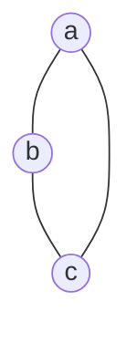
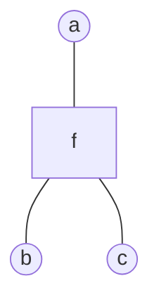

* TOC
{:toc}
# 基本概念

1. 概率图模型用图的形式表现出上图中的各种假设。节点表示随机变量，边表示条件概率
2. 概率图模型有以下三大问题：

1. 在图中引入概率模型，图的概念和数据结构中的图概念一样
2. 同时概率图模型一般处理的是高维随机变量，其中主要关心的是边缘概率$$P(x_i)$$和条件概率$$P(x_j,given,x_i)$$
3. 一些规则：
$$
加法：P(x_1) = \int P(x_1,x_2)dx_2\\
乘法：P(x_1,x_2) = P(x_1)P(x_2|x_1)=P(x_2)P(x_1|x_2)\\
链式：P(x_1,x_2,...,x_p)=P(x_1)\prod_{i=2}^n P(x_i|x_{i-1}-x_{n-1})\\
贝叶斯：P(x_1|x_2)=\frac{P(x_2|x_1)P(x_1)}{P(x_2)}
$$
4. 通过概率图模型可以方便的刻画随机变量间不同的条件独立关系。
# 贝叶斯网络
1. 在联合概率分布和随机变量之间的关系，可以通过拓扑排序获得有向图，而通过有向图可以很快的得到联合概率的因子分解。
$$
P(x_1,x_2,...,x_p) = \prod_{i=1}^p P(x_i|x_{parent(i)})
$$
2. 下图为三种典型的结构：

3. 三种结构的联合概率分布可以写作
$$
第一种：P(a,b,c) = P(a)P(b|a)P(c|a)=p(a)P(b|a)P(c|a,b)->给定a，b与c相互独立\\
第二种：P(a,b,c) = p(a)P(b)P(c|a,b)=p(a)P(b|a)P(c|a,b)->a，b相互独立，给定c则不独立\\
第三种：P(a,b,c) = P(a)P(b|a)P(c|b)=p(a)P(b|a)P(c|a,b)->给定b，a与c相互
$$
通过连式法则证明概率图模型表示了原始的独立假设。
4. 有向图的条件独立性：D划分，如下图

A和B之间的关系如果是第一种或者第三种则中间节点必须存在C中，如果有第二种关系，则必须在C节点之外。
# 马尔科夫网络
1. 无向图没有类似有向图的局部不同结构，在马尔科夫网络中，也可以进行D划分。直接将条件独立几何划分为三个集合，对应的就是全局马尔科夫性。对应上面的D划分就是A与B之间的路径中的节点最少有一个在C中。
2. 成对马尔科夫：a节点与b节点在给定除过a，b节点外的其他节点的情况下，a，b相互独立（a,b之间没有直接联系）
3. 局部马尔科夫：当前点在给定其邻居节点的情况下，其与除过自己和邻居节点外的其他节点相互独立
4. 为了引入因子分解，需要最大团，最大团指的是：图中节点的集合，集合中的节点之间相互都是连接的叫做团，如果不能再添加节点，那么叫最大团。
5. 基于此，对x进行联合概率因子分解，假设K个团，Z对应所有可能取值的求和
$$
P(x) = \frac{1}{Z}\prod_{i=1}^K \psi (x_{ci})\\
Z = \sum_{x\in X}\prod_{i=1}^K \psi (x_{ci})
$$
其中$$\psi (x_{ci})$$为势函数，必须是正数，可以记$$\psi (x_{ci}) = exp(-E(x_{ci}))$$
6. 基于最大团的分解符合条件独立性，基于$$Hammesley-Clifford$$定理可以证明。

# 道德图
1. 将有向图转化为无向图：
$$
第一种：p(a,b,c)=P(b)P(a|b)P(c|b)=\psi (a,b)\psi (b,c)\\
第二种：P(a,b,c)=P(a)P(b|a)P(c|b)=\psi (a,b)\psi (b,c)\\
第三种：P(a,b,c)=P(a)P(c)P(b|a,c)=\psi (a,b,c),于是a，c之间添加了线
$$
2. 总结上面的公式可以概括为：
	- 将每个节点的父节点两两连接
	- 将有向边替换为无向边

# 因子图
注：对于一个有向图，可以通过引入环的方式，可以将其转换为无向图（Tree-like graph），这个图就叫做道德图。但是我们上面的 BP 算法只对无环图有效，通过因子图可以变为无环图。

1. 考了一个无向图：

将其转化为：

2. 其中 $$f=f(a,b,c)$$。因子图不是唯一的，这是由于因式分解本身就对应一个特殊的因子图，将因式分解：$$p(x)=\prod\limits_{s}f_s(x_s)$$ 可以进一步分解得到因子图。

# 推断

