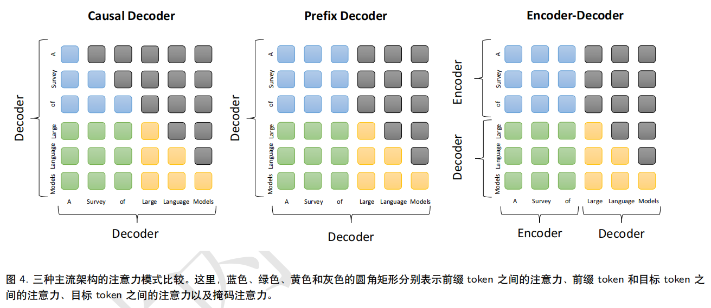
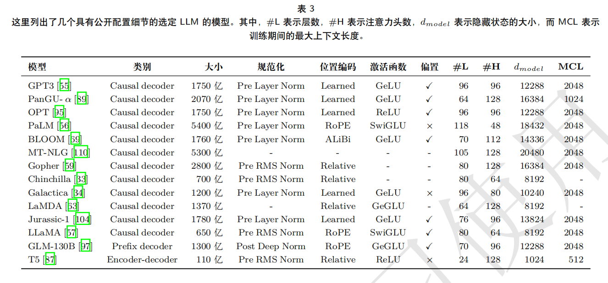
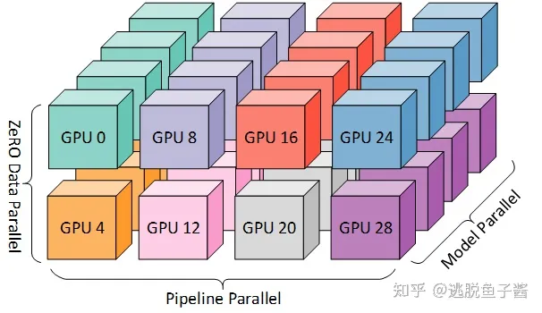
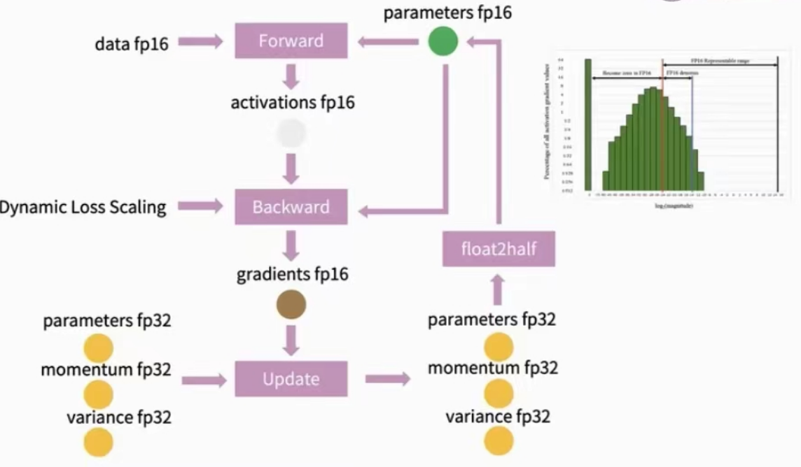

* TOC
{:toc}
# 概述
从技术上讲，语言建模（LM）是提高机器语言智能的主要方法之一。一般来说，LM 旨在对词序列的生成概率进行建模，以预测未来（或缺失）tokens 的概率。语言建模的研究在文献中受到了广泛关注，可以分为四个主要发展阶段：统计语言模型、神经语言模型、预训练语言模型、大语言模型。

# 背景
通常，LLM 是指包含数千亿（或更多）参数的 Transformer语言模型4，这些模型是在大规模文本数据上进行训练的 ，例如 GPT-3，PaLM，Galactica和 LLaMA 。LLM 展现了理解自然语言和解决复杂任务（通过文本生成）的强大能力。
大模型扩展法则：LLM 主要建立在 Transformer架构上 ，其中多头注意力层堆叠在非常深的神经网络中。现有的 LLM 采用类似的 Transformer 架构和与小型语言模型相同的预训练目标（如语言建模）。然而，LLM 大幅度扩展了模型规模、数据规模和总计算量（数量级）。[KM 扩展法则](https://arxiv.org/abs/2001.08361)、[Chinchilla 扩展法则](https://arxiv.org/abs/2203.15556)
大语言模型涌现能力：在小型模型中不存在但在大型模型中产生的能力。[上下文学习](https://dl.acm.org/doi/abs/10.5555/3495724.3495883)假设已经为语言模型提供了一个自然语言指令和/或几个任务演示，它可以通过完成输入文本的单词序列的方式来为测试实例生成预期的输出，而无需额外的训练或梯度更新、[指令遵循](https://openreview.net/forum?id=gEZrGCozdqR)通过使用自然语言描述的混合多任务数据集进行微调（称为指令微调），LLM 在未见过的以指令形式描述的任务上表现出色、[逐步推理](https://arxiv.org/abs/2201.11903)LLM 可以通过利用包含中间推理步骤的提示机制来解决这类任务，从而得出最终答案。这种能力可能是通过在代码上进行训练而获得。
大语言模型的关键技术：扩展、Transformer模型存在很好的扩展效应，通过模型大小、数据大小以及算力的扩张通常可以达到更好的效果；训练、DeepSpeed、Megatron-LM、重新开始、混合精度训练；能力引导；对齐微调、由于 LLM 被训练用来捕捉预训练语料库的数据特征（包括高质量和低质量的数据），它们可能会为人类生成有毒、偏见甚至有害的内容。因此，有必要使 LLM 与人类价值观保持一致，如有用性、诚实性和无害性。[InstructGPT](https://arxiv.org/abs/2203.02155)设计了一种有效的微调方法，使 LLM 能够按照期望的指令进行操作，其中利用了基于人类反馈的强化学习技术。它将人类纳入训练循环中，采用精心设计的标注策略；工具操作。
## GPT
早期探索：主张：由于（特定任务的）有监督目标与无监督（语言建模）目标相同，但只在序列的子集上进行评估，所以无监督目标的全局最小值也是有监督目标的全局最小值（对于各种任务）。
能力飞跃：GPT在将参数量扩展至1750亿，模型能力得到很大提升，同时也开始了in context learning的说法。
能力增强：使用代码数据进行训练增强其推理和数学能力、与人类对齐解决生成有害内容等问题。
语言模型的重要里程碑：ChatGpt、GPT4
# 资源
## 数据集
书籍：[BookCorpus](https://ieeexplore.ieee.org/document/7410368):包括超过 11,000 本电子书，涵盖广泛的主题和类型（如小说和传记）；
[Gutenberg](: https://www.gutenberg.org/):70,000 本文学作品，包括小说、散文、诗歌、戏剧、历史、科学、哲学和其他公共
领域的作品；[Books1](https://arxiv.org/abs/2005.14165)；[Books2](https://arxiv.org/abs/2005.14165)。
开源网络爬虫：[C4](https://www.tensorflow.org/datasets/catalog/c4)、[CC-Stories](http://github.
com/google/jax)、[CC-news](https://arxiv.org/abs/1907.11692)、[Real-News](https://github.com/OpenBMB/BMTrain)
Reddit Links:[OpenWebText](http://Skylion007.github.io/
OpenWebTextCorpus)、[PushShift.io](https://github.com/OpenBMB/BMTrain)
Wikipedia:https://en.wikipedia.org/wiki/Main_Page
代码:[BigQuery](https://cloud.google.com/bigquery?hl=zh-cn)包括开源许可证的公共代码库（例如 GitHub）和与代码相关的问答平台（例如 StackOverflow）
其它：[The Pile](https://arxiv.org/abs/2101.00027)大规模、多样化、开源的文本数据集，有超过 800GB 数据，内容包括书籍、网站、代码、科学论文和社交媒体平台等;[ROOTS](https://arxiv.org/abs/2303.03915)各种较小的数据集（总共 1.61 TB 的文本）组成，覆盖 59 种不同的语言（包括自然语言和编程语言）
## 库资源
Transformers、DeepSpeed、Megatron-LM、JAX、Colossal-AI、BMTrain、FastMoE
# 训练
## 数据
通用文本数据：网页数据、对话数据、书籍
专用文本数据：多语言文本、科学文本、代码

## 数据预处理

## 架构
主流架构：

架构详细配置：

建议配置：选择前置的 RMS进行层标准化，并选择 SwiGLU 或 GeGLU 作为激活函数。此外，在位置编码方面，RoPE 或 ALiBi 是更好的选择。
预训练任务：语言建模、去噪自编码
## 模型训练

3D并行：
```
流水线并行：将 LLM 的不同层分配到多个 GPU 上
张量并行：分解 LLM 的张量（参数矩阵）。对于 LLM 中的矩阵乘法操作 Y = XA，参数矩阵 A 可以按列分成两个子矩阵 A1和 A2，从而将原式表示为 Y = [XA1, XA2]。通过将矩阵 A1和 A2 放置在不同的 GPU 上，矩阵乘	法操作将在两个 GPU上并行调用，并且可以通过跨 GPU 通信将两个 GPU 的输出组合成最终结果。
数据并行：每个 GPU 只需要处理分配给它的数据，并执行前向和反向传播以获取梯度。在不同 GPU 上计算的梯度将进一步聚合以获得整个批量的梯度，以更新所有 GPU 上的模型。
```
一个3D并行的例子：模型被分成4个stage，流水线并行度为4；每台机器有8张GPU，张量并行度为4，数据并行度为2；GPU分配如下图：

混合精度训练：

# 大模型适配微调


# 参考
1.[llm综述](https://github.com/RUCAIBox/LLMSurvey)