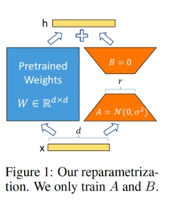
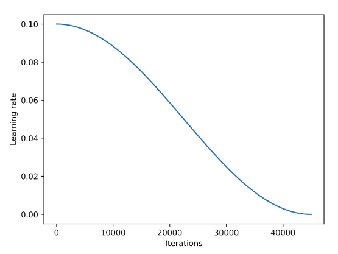

* TOC
{:toc}
# 为什么需要高效微调
自然语言处理的任务中，从bert出现之后，基本的流程就是预训练+微调。微调需要针对每个下游任务来进行，同时微调后的模型和原始模型是一样大的。这种形式对于bert、gpt来说还勉强可以接受，但是对于再大的模型如gpt3(175B)等就是一个很大的挑战了。
所以我们需要一些可以快速的微调类似gpt3类的大模型，同时也不需要太多的存储。
# prompt tuning

# p-tuning

# p-tuningv2

# adapt tuning

# lora

[lora](https://arxiv.org/pdf/2106.09685.pdf)提出的依据：模型是过参数化的，它们有更小的内在维度，模型主要依赖于这个低的内在维度（low intrinsic dimension）去做任务适配。
# 基础
思路：
1. 在原模型侧边增加旁路，做降维升维的操作来模拟内在维度。
2. 固定原模型，只训练图中的AB矩阵。
3. A初始化高斯分布，B初始化全0（保证训练开始时旁路维0）

假设需要微调一个语言模型，需要对其参数进行更新，权重表示为$W_0+\triangle W$ ,其中$W_0$表示预训练语言的参数，$triangle W$表示需要更新的参数。如果是全量微调则微调的参数和语言模型参数一样。

而如果微调方式切换到lora的话，需要的参数如下：
首先预训练模型的参数为$W_0 \in R^{d*k}$  进而参数更新可以转换为:
$$
W_0 + \triangle W =  W_0 + BA,  B \in R^{d*r} , A \in R^{d*r}
$$
训练过程中只需要调节A和B的参数就可以。前向计算为:
$$
h = W_0x+ \triangle W x = W_0 x +BAx = (W_0 + AB)x
$$

==A矩阵不能全0初始化，B矩阵可全0初始化==
对于$h = W_0x + BAx$ ，假设$h^{()2}$，则：
$$
h_i^{(2)}=\sum_j z_{i, j} x_j=\sum_j\left(\sum_k B_{i, k} A_{k, j}\right) x_j
$$
## 训练策略
加入学习率调度器通常可以稳定训练，余弦退火是一种常用的学习率调度器，首先从一个较高的学习率开始平滑递减，以一种类似余弦函数的方式逼近零点，在使用的时候通常是半周期的变体，即在训练过程中只完成半个余弦周期，如下图所示：

经验：对于SGD提升比较明显，但是对Adam，AdamW影响较小。

==？为什么不使用SGD作为优化函数，其相对Adam等优化器节省了多余参数的存储，可以降低对GPU显存的使用==

对数据循环多次使用，并不会提升性能，相反可能会导致结果的恶化。

lora在前向传播的时候引入了扩展系数，用于将lora的权重应用于预训练权重，涉及到的参数有r，alpha。具体计算为$scaling = alpha / r$，$weight += (lora_b @ lora_a) * scaling$。

通常设置r 为alpha的一半性能较好，但是对一些特定数据集也可能有更好的经验参数。

学习率设置3e-4，梯度累积的使用，weight_decay=0.1,warmup_steps=100
如果是SGD的话，学习率0.1。动量0.9

# qlora

# 参考
1. [知乎1](https://www.zhihu.com/tardis/zm/art/623543497?source_id=1003)
2. [智源1](https://hub.baai.ac.cn/view/33321)