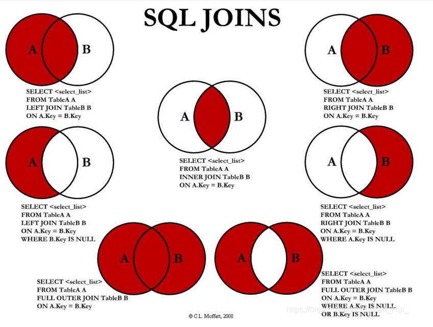

<<<<<<< HEAD
---
layout:     post
title:      "hive"
subtitle:   " \"hive\""
date:       2021-03-22 18:00:00
author:     "zwt"
header-img: "img/post-bg-2015.jpg"
catalog: false
tags:
    - 工具
---
* TOC
{:toc}

# hive操作问题
内存溢出
```
set hive.execution.engine=tez;
set mapreduce.map.memory.mb=10240;
set mapreduce.map.java.opts=-Xmx2048m;
set mapreduce.reduce.memory.mb=10240;
set mapreduce.reduce.java.opts=-Xmx2048m;
```

# sql
```python
1.清空表	truncate table tablename;
2.删除表	drop table if exists tablename;
3.行号，同样的数据会有不同的行号 row_number() over(order by id) as num0
4.编号，同样数据编号相同， rank() over 
5.编号 同样数据相同编号，后面继续接着 dense_rank()
6.复制创建表  create table tname as selet * from taname2
7.拼接  concat()
8.插入拼接数据  insert into
9.插入覆盖	inert overwrite
10.导出数据 hive -e "select * from data_model.wid_pid_hash_temp;" > wid_pid_hash_temp.txt
11.分组异常：FAILED: SemanticException [Error 10025]: Line 1:12 Expression not in GROUP BY key
select market, collect_set( province ) from table_name group by market;
12.array转string：concat_ws(",",column)
13.强转类型：cast(column as string)
14.spark写入hive：TmpDF.createOrReplaceTempView('TmpData')
15.添加自增列：select row_number() over(order by 1) as id,table.* from table
在B中不在A中：select * from B where (select count(1) as num from A where A.ID = B.ID) = 0
15.更改列名：ALTER TABLE employee CHANGE name ename String;
16.增加列：alter table employee add columns(name string);
17.拆分列：select t.name,t.ssmcs[0] as ssmc1,t.ssmcs[1] as ssmc2,t.ssmcs[2] as ssmc3 from (select name,split(ssmc,"\\|") as ssmcs from testArray) t
18.字符串替换：regexp_replace('2016-06-05', '-', '')
19.一个字段包含另一个字段：select array_contains(split("b",' '),a) ;
取出第一个json的age字段的值：SELECT get_json_object(xjson,"$.[0].age") FROM person;
20.nvl函数：NVL(expr1, expr2)，如果expr1为NULL，返回值为 expr2，否则返回expr1
21.关键字作为列名：`timestamp`
22.解析struct：
select wid, pid, subview.* from private_weitao_dot_zhang.alsResult lateral view explode(itemlist.product) subview limit 1;
23.解析json字段：{"name":"hrr","age":12,"subject":[{"name":"math","level":1}]}
get_json_object($"value","$.age")
24.多行合并为一行：select user,concat_ws(',',collect_set(concat（order_type,'(',order_number,')'）))  order from table group by user
25.df_unionid = df_unionid.withColumn("id", monotonically_increasing_id()+1)生成自增id
26.collect_list后排序：sort_array
27.时间求差：unix_timestamp() - unix_timestamp(ymdhms)
28.集合查找函数：find_in_set(string str, string strList)
29.ngram：ngram("", 2, 100, 1000)
30.rlike '[\\u4e00-\\u9fa5]+'  匹配汉字
31.rlike '^[a-zA-Z0-9]+$'  只包含数字和字母
32.ALTER TABLE test_table DROP PARTITION (dt='2016-08-08', hour='10')  删除某个分区
33.select regexp_extract('这里china', '[\u4e00-\u9fa5]+', 0)
34.ALTER TABLE employee RENAME TO emp
35.from_unixtime(unix_timestamp(yyyymmdd, 'yyyymmdd'), 'yyyy-mm-dd')
36.map_values(Map)函数：可得map中所有的value; 返回值类型: array
37.map_keys(Map)函数：可得map中所有的key; 返回值类型: array
```


# hbase & hive
关联hive和hbase
```
CREATE EXTERNAL TABLE tablename(column)
STORED BY 'org.apache.hadoop.hive.hbase.HBaseStorageHandler'
WITH SERDEPROPERTIES ("hbase.columns.mapping" = ":key,列簇:column")
TBLPROPERTIES ("hbase.table.name" = "hbasetablename");
```

# hive事务
```
set hive.support.concurrency=true;
set hive.txn.manager=org.apache.hadoop.hive.ql.lockmgr.DbTxnManager;
drop table tmp_ccc_20180716;
create table tmp_ccc_20180716(id int,age int)
clustered by (id) into 8 buckets
stored as orc 
TBLPROPERTIES ('transactional'='true');
-- 建表语句必须带有 into buckets 子句和 stored as orc TBLPROPERTIES ('transactional'='true') 子句，并且不能带有 sorted by 子句。
```

# 注意
```
1.count如果直接是列名的话会导致丢失为null的数据
2.where、group by、having、order by执行顺序：where->group by->select->having ->order by
```
# hdfs
```
1.hadoop fs -ls 查看当前目录下文件
2.hadoop fs -put
3.hadoop fs -get 
4.hadoop fs -cp
5.hadoop fs -tail
6.hadoop fs -cat
7.hadoop fs -mkdir -p /user/data
8.hadoop fs -rm -r 文件夹
9.hadoop fs -rm 文件
10.hadoop fs -cat filename | wc -l 查看文件行数
11.hdfs dfs -du -h /user/hive/warehouse/ 查看文件大小
12.hadoop dfs -rmr hdfs//
13.hadoop fs -du  统计目录下各文件大小，单位字节。
14.-du -s 汇总目录下文件大小，
15.-du -h 显示单位
16.hadoop fs -text  查看文件内容
```
## topK
```
select pid,goodsid,count,goodsid2,count2,score from 
(select * from (select *, row_number() over(PARTITION BY pid, goodsid ORDER BY score DESC) rank from 
(select * from df_tmp_view1 where count2 >4 and goodsid != goodsid2) as t)) as a where a.rank <= 100
```
# 参考
1.[事务](https://www.cnblogs.com/chenzechao/p/9318379.html)
2.[join](https://blog.csdn.net/u013019701/article/details/120058568)
=======
---
layout:     post
title:      "hive"
subtitle:   " \"hive\""
date:       2021-03-22 18:00:00
author:     "zwt"
header-img: "img/post-bg-2015.jpg"
catalog: false
tags:
    - 工具
---
* TOC
{:toc}

# hive操作问题
内存溢出
```
set hive.execution.engine=tez;
set mapreduce.map.memory.mb=10240;
set mapreduce.map.java.opts=-Xmx2048m;
set mapreduce.reduce.memory.mb=10240;
set mapreduce.reduce.java.opts=-Xmx2048m;
```

# sql
```python
1.清空表	truncate table tablename;
2.删除表	drop table if exists tablename;
3.行号，同样的数据会有不同的行号 row_number() over(order by id) as num0
4.编号，同样数据编号相同， rank() over 
5.编号 同样数据相同编号，后面继续接着 dense_rank()
6.复制创建表  create table tname as selet * from taname2
7.拼接  concat()
8.插入拼接数据  insert into
9.插入覆盖	inert overwrite
10.导出数据 hive -e "select * from data_model.wid_pid_hash_temp;" > wid_pid_hash_temp.txt
11.分组异常：FAILED: SemanticException [Error 10025]: Line 1:12 Expression not in GROUP BY key
select market, collect_set( province ) from table_name group by market;
12.array转string：concat_ws(",",column)
13.强转类型：cast(column as string)
14.spark写入hive：TmpDF.createOrReplaceTempView('TmpData')
15.添加自增列：select row_number() over(order by 1) as id,table.* from table
在B中不在A中：select * from B where (select count(1) as num from A where A.ID = B.ID) = 0
15.更改列名：ALTER TABLE employee CHANGE name ename String;
16.增加列：alter table employee add columns(name string);
17.拆分列：select t.name,t.ssmcs[0] as ssmc1,t.ssmcs[1] as ssmc2,t.ssmcs[2] as ssmc3 from (select name,split(ssmc,"\\|") as ssmcs from testArray) t
18.字符串替换：regexp_replace('2016-06-05', '-', '')
19.一个字段包含另一个字段：select array_contains(split("b",' '),a) ;
取出第一个json的age字段的值：SELECT get_json_object(xjson,"$.[0].age") FROM person;
20.nvl函数：NVL(expr1, expr2)，如果expr1为NULL，返回值为 expr2，否则返回expr1
21.关键字作为列名：`timestamp`
22.解析struct：
select wid, pid, subview.* from private_weitao_dot_zhang.alsResult lateral view explode(itemlist.product) subview limit 1;
23.解析json字段：{"name":"hrr","age":12,"subject":[{"name":"math","level":1}]}
get_json_object($"value","$.age")
24.多行合并为一行：select user,concat_ws(',',collect_set(concat（order_type,'(',order_number,')'）))  order from table group by user
25.df_unionid = df_unionid.withColumn("id", monotonically_increasing_id()+1)生成自增id
26.collect_list后排序：sort_array
27.时间求差：unix_timestamp() - unix_timestamp(ymdhms)
28.集合查找函数：find_in_set(string str, string strList)
29.ngram：ngram("", 2, 100, 1000)
30.rlike '[\\u4e00-\\u9fa5]+'  匹配汉字
31.rlike '^[a-zA-Z0-9]+$'  只包含数字和字母
32.ALTER TABLE test_table DROP PARTITION (dt='2016-08-08', hour='10')  删除某个分区
33.select regexp_extract('这里china', '[\u4e00-\u9fa5]+', 0)
34.ALTER TABLE employee RENAME TO emp
35.from_unixtime(unix_timestamp(yyyymmdd, 'yyyymmdd'), 'yyyy-mm-dd')
36.map_values(Map)函数：可得map中所有的value; 返回值类型: array
37.map_keys(Map)函数：可得map中所有的key; 返回值类型: array
```


# hbase & hive
关联hive和hbase
```
CREATE EXTERNAL TABLE tablename(column)
STORED BY 'org.apache.hadoop.hive.hbase.HBaseStorageHandler'
WITH SERDEPROPERTIES ("hbase.columns.mapping" = ":key,列簇:column")
TBLPROPERTIES ("hbase.table.name" = "hbasetablename");
```

# hive事务
```
set hive.support.concurrency=true;
set hive.txn.manager=org.apache.hadoop.hive.ql.lockmgr.DbTxnManager;
drop table tmp_ccc_20180716;
create table tmp_ccc_20180716(id int,age int)
clustered by (id) into 8 buckets
stored as orc 
TBLPROPERTIES ('transactional'='true');
-- 建表语句必须带有 into buckets 子句和 stored as orc TBLPROPERTIES ('transactional'='true') 子句，并且不能带有 sorted by 子句。
```

# 注意
```
1.count如果直接是列名的话会导致丢失为null的数据
2.where、group by、having、order by执行顺序：where->group by->select->having ->order by
```
# hdfs
```
1.hadoop fs -ls 查看当前目录下文件
2.hadoop fs -put
3.hadoop fs -get 
4.hadoop fs -cp
5.hadoop fs -tail
6.hadoop fs -cat
7.hadoop fs -mkdir -p /user/data
8.hadoop fs -rm -r 文件夹
9.hadoop fs -rm 文件
10.hadoop fs -cat filename | wc -l 查看文件行数
11.hdfs dfs -du -h /user/hive/warehouse/ 查看文件大小
12.hadoop dfs -rmr hdfs//
13.hadoop fs -du  统计目录下各文件大小，单位字节。
14.-du -s 汇总目录下文件大小，
15.-du -h 显示单位
16.hadoop fs -text  查看文件内容
```
## topK
```
select pid,goodsid,count,goodsid2,count2,score from 
(select * from (select *, row_number() over(PARTITION BY pid, goodsid ORDER BY score DESC) rank from 
(select * from df_tmp_view1 where count2 >4 and goodsid != goodsid2) as t)) as a where a.rank <= 100
```
# 参考
1.[事务](https://www.cnblogs.com/chenzechao/p/9318379.html)
2.[join](https://blog.csdn.net/u013019701/article/details/120058568)
>>>>>>> d5005ecd9eaf3ce32260dc1b7d831c7f2a1a85f3
