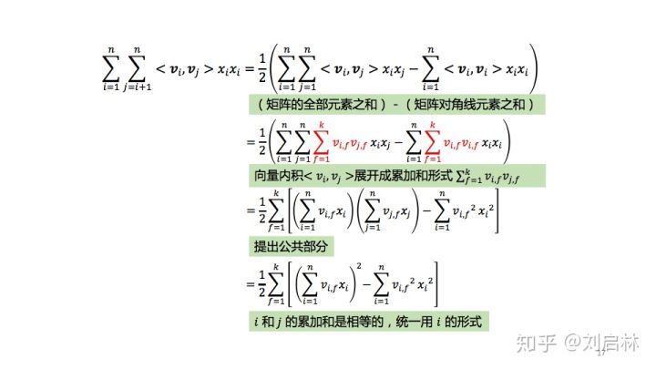

* TOC
{:toc}
# 问题
逻辑回归作为推荐模型中的经典模型是对所有特征的线性加权组合，进而基于sigmod函数来进行非线性的加入：
$$
\hat{y}(x)=w_0+w_1 x_1+\ldots+w_n x_n=w_0+\sum_{i=1}^n w_i x_i
$$
其缺陷就在于仅仅考虑了单一的特征，对于特征之间的关系并没有考虑进去，FM的提出就是为了解决稀疏数据下的特征组合问题。
# POLY2
POLY2模型（Degree-2 Polynomial Margin）是在LR模型的基础上进行了特征的暴力组合
$$
y=w_{0}+\sum_{i=1}^{n} w_{i} x_{i}+\sum_{i=1}^{n} \sum_{j \geq i}^{n} w_{i j} x_{i} x_{j}
$$
其中$w_{i,j}$是特征$(i,j)$的权重，但是在几时得计算过程中，并不是每个特征组合都会存在相互作用所以组合特征会存在为0得情况，此时对于梯度得更新就会不充分不准确。
# FM
FM假设特征之间两两相关。
因子分解机就可以解决组合特征不存在得情况。因为其为每一个特征学习了一个隐含向量。
$$
\mathrm{y}=w_{0}+\sum_{i=1}^{n} w_{i} x_{i}+\sum_{i=1}^{n} \sum_{j=i+1}^{n}<v_{i}, v_{j}>x_{i} x_{j}
$$
简化计算逻辑：

## 参数更新
对于$w_0$：
$$
\frac{\partial \hat{y}(x)}{\partial w_0}=1
$$
对于$w_i$：
$$
\frac{\partial \hat{y}(x)}{\partial w_i}=x_i
$$
对于$v_{i,f}$:
$$
\begin{aligned}
\frac{\partial \hat{y}(x)}{\partial v_{i, f}} &=\frac{\partial \frac{1}{2}\left(\left(\sum_{i=1}^n v_{i, f} x_i\right)^2-v_{i, f}^2 x_i^2\right)}{\partial v_{i, f}} \\
&=\frac{1}{2}\left(2 x_i \sum_{i=1}^n v_{i, f} x_i-2 v_{i, f} x_i^2\right) \\
&=x_i \sum_{j=1}^n v_{j, f} x_j-v_{i, f} x_i^2 .
\end{aligned}
$$
总结FM模型的参数更新为：
$$
\frac{\partial \hat{y}(x)}{\partial \theta}= \begin{cases}1, & \text { if } \theta \text { is } w_0 \\ x_i, & \text { if } \theta \text { is } w_i \\ x_i \sum_{j=1}^n v_{j, f} x_j-v_{i, f} x_i^2, & \text { if } \theta \text { is } v_{i, f}\end{cases}
$$
## 损失函数
回归问题：平方差损失函数
$$
Loss =\frac{1}{2} \sum_{i=1}^n\left(\hat{y}_i-y_i\right)^2
\\
求导结果 \frac{\partial L}{\partial \hat{y}(x)}=(\hat{y}(x)-y)
\\
平方损失函数的梯度为  \frac{\partial L}{\partial \theta}=(\hat{y}(x)-y) * \frac{\partial \hat{y}(x)}{\partial \theta}
$$
分类问题：对数损失函数
$$
\begin{gathered}
\text { Loss }=\frac{1}{2} \sum_{i=1}^n-\ln \left(\sigma\left(\hat{y}_i y_i\right)\right)^2 \\
\sigma(\hat{y} y)=\frac{1}{1+e^{-\hat{y} y}} \\
\frac{\partial(\sigma(\hat{y} y))}{\partial \hat{y}}=\sigma(\hat{y} y) *[1-\sigma(\hat{y} y)] * y
\end{gathered}
$$
对数函数下的梯度为：
$$
\begin{aligned}
&\frac{\partial L}{\partial \theta}=\frac{1}{\sigma(\hat{y} y)} * \sigma(\hat{y} y) *  [1-\sigma
(\hat{y} y)] * y * \frac{\partial \hat{y}(x)}{\partial \theta} \\
&=[1-\sigma(\hat{y} y)] * y * \frac{\partial \hat{y}(x)}{\partial \theta}
\end{aligned}
$$

# 参考
1. [FM](https://zhuanlan.zhihu.com/p/153500425)
2. [FM2](https://zhuanlan.zhihu.com/p/145436595?utm_source=qq)