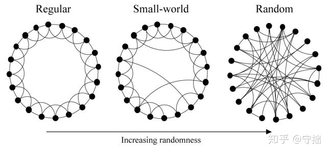
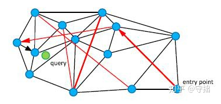
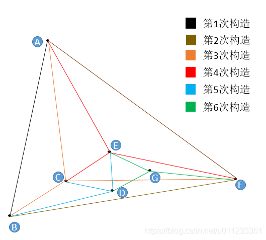
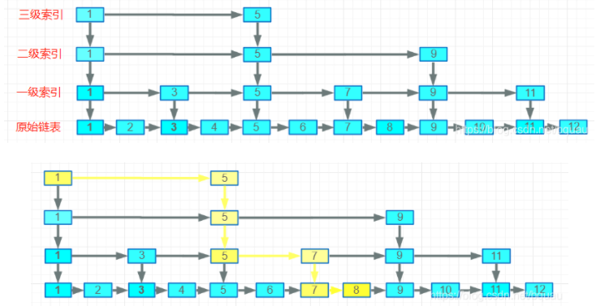
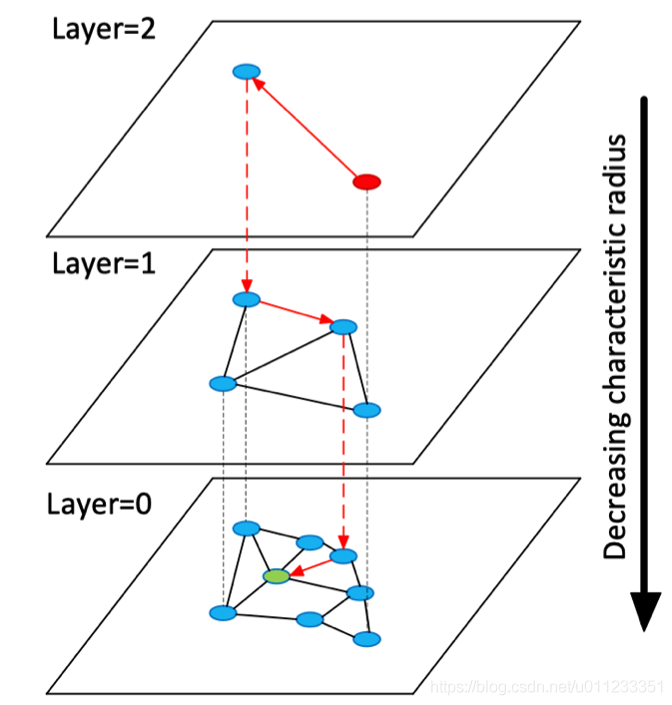

* TOC
{:toc}

# 基本概念
```
1.CPA(Cost Per Action): 按成果数计费
2.CPC (Cost Per Click): 按点击计费
3.CPM (Cost Per Mille): 按千次展现计费
4.CVR (Click Value Rate): 转化率，衡量CPA广告效果的指标
5.CTR (Click Through Rate): 点击率
6.PV (Page View): 流量
7.ADPV (Advertisement Page View): 载有广告的pageview流量
8.ADimp (ADimpression): 单个广告的展示次数
9.PV单价: 每PV的收入，衡量页面流量变现能力的指标
10.RPS (Revenue Per Search): 每搜索产生的收入，衡量搜索结果变现能力指标
11.ROI： 投资回报率（ROI）是指通过投资而应返回的价值，它涵盖了企业的获利目标。利润和投入的经营所必备的财产相关，因为管理人员必须通过投资和现有财产获得利润。又称会计收益率、投资利润率。
12.UV(独立访客)：Unique Visitor,访问您网站的一台电脑客户端为一个访客。00:00-24:00内相同的客户端只会被计算一次。
13.PV(访问量)：PageView,即页面浏览量或点击量，用户每次刷新即被计算一次
14.客单价：是经济学上的专业术语，指每一位顾客平均购买商品金额。
公式：客单价＝商品平均单价×每一顾客平均购买商品个数
15.转化率：指在一个统计周期内，完成转化行为的次数占推广信息总点击次数的比率。
公式：转化率=(转化次数/点击量)×100%。
举例：某店当天的访客数（UV）为5000，其中50名用户有了后续转化的行为。那么，其转化率就是(50/5000)×100%=1%。
16.销售额（GMV）=访客数×全店成交转化率×客单价
举例：某店当天的UV是191251，全店转化率为3.36%，客单价为199.69。那么该店当天的销售额就是191251*3.36%*199.69=1283214.6
```

# 向量召回
## 向量生成

## 向量检索
### HNSW
#### small world random graph
正则图和随机图：
```
1.正则图指的是每个顶点都有相同的邻居数。
2.随即图指的是在随机的过程中构建的图。
```
small world：
```
在1967年Stanley Milgram从Kansas和Nebraska两个州招募了一批志愿者， 请他们分别将一封信转寄给一个住在Cambridge神学院学生的妻子和一个住在Boston郊区的股票经纪人。 他给志愿者们这样的要求：
1.虽然有寄信目标的相关信息，如果不是私人关系，不能把信直接寄给TA.
2.每次只能把信寄给最有可能知道这个人的熟人。
3.原始信封里有15张追踪卡片，每次转寄都要回寄一张给实验者，其他的放在信封里寄给下一个人，这样研究员可以随时追踪这些信函的路径。

在到达的信函中，Stanley Milgram计算信函平均到达的节点为5个，也就是我们和一个陌生人建立连接只需要6步。

基于上述实验得出结论：
1.现实世界中的短路经是普遍存在的
2.人们可以有效地找到并且利用这些短路径

点之间的关系可以分为两种：
1.同质性：相似的点会聚集到一起，相互连接具有邻接边
2.弱连接：弱连接是指从一个节点上，会有一些随机的边随机的连接到网络中的节点上，这些节点是随机均匀的
```
三者的关系：

#### NSW

在NSW算法中，通过构建一个小世界网络，希望通过黑色相似的近邻边来检索最近邻接点，通过红色边来实现不同类节点之间的快速检索。
##### 图的检索
K近邻查找：candiates表示当前要考察的结合集合，visitedset表示已经访问过的集合，results表示当前距离查询点最近的点的集合。前两种是变长的，results是定长的。
```
1.随机选择一个元素，放入到candidates中，同时加入visitedset
2.从candidates中选取最近邻节点c，和result中距离查询点最远的点d进行比较，如果c和查询点q的距离大于d和查询点q的距离，则结束查询，说明当前图中所有距离查询点最近的都已经找到了，或者candidates为空
3.从candidates中移除最近邻节点c
4.查询c的所有邻居e，如果e已经在visiteset中则跳过，不存在则加入visitedset
5.把比d和q距离更近的e加入到candidates，result中，如果results未满，则把所有的e都加入到candidates，results中，如果results已满，则弹出和q距离最远的点。
6.循环2-5步骤。
```
##### 图的构建

```
我们对7个二维点进行构图，用户设置m=3（每个点在插入时找3个紧邻友点）:
1.首先初始点是A点（随机出来的），A点插入图中只有它自己，所以无法挑选“友点”。
2.然后是B点，B点只有A点可选，所以连接BA，此为第1次构造。
3.然后插入F点，F只有A和B可以选，所以连接FA，FB，此为第2此构造。
4.然后插入了C点，同样地，C点只有A，B，F可选，连接CA，CB，CF，此为第3次构造。
5.重点来了，然后插入了E点，E点在A，B，F，C中只能选择3个点（m=3）作为“友点”，根据我们前面讲规则，要选最近的三个，怎么确定最近呢？朴素查找！从A，B，C，F任意一点出发，计算出发点与E的距离和出发点的所有“友点”和E的距离，选出最近的一点作为新的出发点，如果选出的点就是出发点本身，那么看我们的m等于几，如果不够数，就继续找第二近的点或者第三近的点，本着不找重复点的原则，直到找到3个近点为止。由此，我们找到了E的三个近点，连接EA，EC，EF，此为第四次构造。
6.第5次构造和第6次与E点的插入一模一样，都是在“现成”的图中查找到3个最近的节点作为“友点”，并做连接。

图画完了，请关注E点和A点的连线，如果我再这个图的基础上再插入6个点，这6个点有3个和E很近，有3个和A很近，那么距离E最近的3个点中没有A，距离A最近的3个点中也没有E，但因为A和E是构图早期添加的点，A和E有了连线，我们管这种连线叫“高速公路”，在查找时可以提高查找效率（当进入点为E，待查找距离A很近时，我们可以通过AE连线从E直接到达A，而不是一小步一小步分多次跳转到A）。
```
##### nsw问题
```
对于最先插入的节点，其连接的邻居节点，基本都比较远(弱连接属性较强)
对于最后插入的节点，其连接的邻居节点，基本都比较近(弱连接属性较弱)
对于具有聚类效应的点，由于后续插入的点可能都和其建立连接，对应节点的度可能会比较高。
```
#### hnsw
借助跳表来优化nsw：

通过跳表来保证表层未高速通道，底层未精确查找，将其应用到nsw中就得到了其升级版本hnsw。

```
1.在Layer = 0 层中，包含了连通图中所有的点。
2.随着层数的增加，每一层的点数逐渐减少并且遵循指数衰减定律
3.节点的最大层数，由随机指数概率衰减函数决定。
4.从某个点所在的最高层往下的所有层中均存在该节点。
5.在对HNSW进行查询的时候，从最高层开始检索。
```


# 参考
1.[搜索召回](https://www.6aiq.com/article/1599345196009)
2.[策略算法](https://zhuanlan.zhihu.com/p/97357462)
3.[纠错](https://blog.csdn.net/catherine_985/article/details/78789089)
4.[hnsw](https://zhuanlan.zhihu.com/p/264832755)
5.[hnsw1](https://zhuanlan.zhihu.com/p/264832755)
6.[nn](https://zhuanlan.zhihu.com/p/152522906)
7.[hnsw2](https://blog.csdn.net/u011233351/article/details/85116719)

