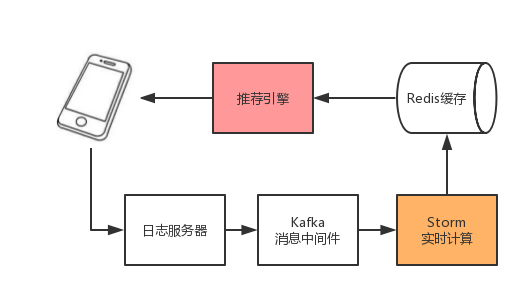
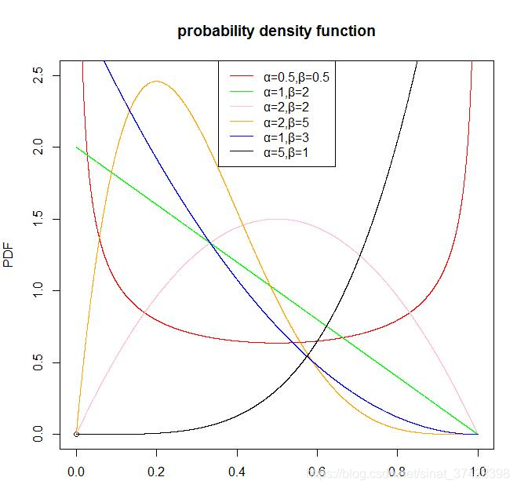

* TOC
{:toc}

# 概述
起源于赌博学：一个赌徒在摇老虎机的时候，发现有一排一样的老虎机，但是每台机器的中奖概率不一样，当然赌徒也不知道真实的老虎机中奖的概率分布，那么如何才可以实现最大化摇动老虎机的收益，这就是多臂老虎机问题：Multi-armed bandit problem, K-armed bandit problem, MAB

类比如推荐系统:

```
1.对新用户如何快速的了解其兴趣爱好
2.如何科学的进行商品多样性的增加
3.对于丰富的广告库或者商品库，如何了解为那些用户展示那些商品或者广告，如果每次都拿最好的，那那些新的广告就永远不会被展示
4.新训练一个模型有什么方法可以比abtest更快的了解那个模型较优
```
## 探索和利用
Exploration and Exploitation(EE问题，探索与开发)：
```
1.探索：用户会对所推荐的商品失去兴趣，需要不断的探索用户新的兴趣
2.开发：对用户感兴趣的尽可能的利用
```
## bandit与推荐系统
对于新用户来说，怎么通过多次试验来有目的的对其兴趣进行建模：
```
用topic表示用户的兴趣，对应MAB中的Arm，通过若干次实验，对新用户的兴趣爱好进行刻画，了解其对每个topic的感兴趣概率。
如果用户对某个topic感兴趣，就表示有了收益，如果不感兴趣就产生遗憾。
经过选择-观察-更新-选择的循环，理论上就会逼近用户的兴趣点。
```
## 累计遗憾
通常通过累计遗憾regret来 表示 Bandit算法的效果
$$
R_{T}=\sum_{i=1}^{T}\left(w_{o p t}-w_{B(i)}\right)=T \cdot W^{*}-\sum_{i=1}^{T} w_{B(i)}
$$
其中$w_{B(i)}$是第i次试验中被选中的臂的期望收益，$w^*$是所有臂中最优的哪一个。用不同的Bandit算法进行相同次数的试验，看regret增长慢的是哪一个。
# Bandit
首先随机的试验，然后进行平均收益的计算，一直选取平均收益最大的臂
## Epsilon-Greedy
在0-1之间选取$\epsilon$，每次都以$\epsilon$的概率在所有臂中选取一个，然后通过$1 - \epsilon$选取截止当前平均收益最大的臂，依据回报的结果进行收益的更新。
基本思想：
1.以ε的概率选择探索 (Exploration)：从N个item中选择一个给到user，根据反馈更新每个item的被选择的概率。 
2.以1-ε的概率选择利用 (Exploitation)：从N个item中选择最好的item推荐给用户。
存在问题：
1.在推荐次数相同的情况下，好和不好的item被探索推荐的概率是一样的
2.在推荐的成功概率相同的情况下，被推荐次数多的和次数少的item得到再被推荐的概率是一样的


## Thompson sampling 
Thompson sampling算法用到了Beta分布，其中假设每个臂是否产生收益，其背后是有一个概率分布，而产生的收益P是符合Beta(wins,lose)分布，每一个臂都维护一套Beta分布的参数，在每次试验之后，选中其中的某个臂摇一下，有收益的臂win加1，否则lose加1
### Beta分布
定义域：[0,1]
参数：$\alpha , \beta$,都是正数，称之为形状参数，不同的组合有不同的宽窄以及平移情况
概率密度函数：
$$
f(x ; \alpha, \beta)=\frac{1}{B(\alpha, \beta)} x^{\alpha-1}(1-x)^{\beta-1}=\frac{\Gamma(\alpha+\beta)}{\Gamma(\alpha) \Gamma(\beta)} x^{\alpha-1}(1-x)^{\beta-1}
$$
其中$\Gamma$为Gamma函数，是阶乘的扩展
$$
\Gamma(x)=\int_{0}^{+\infty} t^{x-1} e^{-t} \mathrm{~d} t(x>0)
$$
Beta的方差为：
$$
\frac{\alpha \beta}{(\alpha+\beta)^{2}(\alpha+\beta+1)}
$$
Beta的均值为：
$$
\frac{\alpha}{\alpha+\beta}
$$
Beta分布的图形：

从图中可以看出
```python
1.均值越大，概率密度分布的中心位置越靠近1，结果就是所产生的值大多数都靠近1，反之则靠近0
2.均值的分母越大，表示分布越窄，则产生的数越集中于中心位置。
```
## UCB
全称为Upper Confidence Dound 置信区间上界。具体的步骤是：对每个臂都尝试一下，然后在其他的时刻基于以下公式更新计算每个臂的分数，然后选择其中分数最大的臂作为选择：
$$
\bar{x}_{j}+\sqrt{\frac{2 \ln t}{T_{j}}}
$$

$$
a*{x}_{u,j}+b*\sqrt{\frac{2 \ln t_{u,j}}{T_{j}}}
$$
```
基本思想：对某个item尝试的次数越多则对该item回报估计的置信区间越窄，估计的不确定性也就减小。从而均值大的item被选择的次数增多（exploitation）。对某些item的尝试次数较少，则其置信区间较宽，不确定高，则置信区间宽的item被倾向选择（exploration）
分母为item j的曝光次数，分子为总的曝光次数
```
示例：
```
假设现在摇一次骰子得到的点数为2，则均值为2，实际上均值为3.5，但是显然这个估计不靠谱，可以用置信区间来衡量变化的估计，均值为2，其95置信区间的上下限为分别5.2、1.4
```
## LinUCB
优化ucb算法的上下文无关，不关注面临的用户或者商品具体是什么的问题。
```
假设在对user推送item的时候，其反馈和相关的特征有线性关系
```
在时间t，对于用户$u_t$，可选择的商品a的特征向量为$x_{t,a}$，$x_{t,a}$作为上下文信息，表示用户和商品的特征。算法依据历史的反馈进行item的选择$a_t$，同时收到用户的反馈收益$r_{t,a_t}$，$r_{t,a_t}$的期望由用户和商品共同决定，然后依据反馈$(x_{t,a},a_t,r_{t,a_t})$对候选排序进行改进，目标是使得整个过程中的损失最小，也就是遗憾最小$R_A(T)$。
$$
R_{A}(T)=E\left[\sum_{t=1}^{T} r, a_{t}^{*}\right]-E\left[\sum_{t=1}^{T} r, a_{t}\right]
$$
其中T表示实验的总步数，$a^*$表示在时间t是最大的收益的arm。
LinUCB中，设定的是每一个arm的期望收益和特征向量为线性关系的。
$$
E\left[r_{t, a} \mid x_{t, a}\right]=x_{t, a}^{T} \theta_{a}
$$
其中$\theta_{a}$是模型的参数，维度为d，每一个arm都维护一个$\theta_{a}$
对于单个arm，通过前m个comtext向量组成的矩阵为$D_a$，维度为m*n。前m个收益组成的向量为$C_a$。基于平方误差函数：
$$
\operatorname{loss}=\sum_{i=1}^{m}\left(c_{a, i}-\sum_{j=0}^{d} \theta_{a, j} x_{i j}\right)^{2}+\lambda \sum_{j=0}^{d} \theta_{a, j}^{2}
$$
其中$\lambda$是正则项系数，求损失函数的最小值，对$\theta_{a}$求导：
$$
\nabla_{\theta_{a}} \text { loss }=2 D_{a}^{T}\left(c_{a}-D_{a} \theta_{a}\right)+2 \lambda \theta_{a}
$$
令$\nabla_{\theta_{a}} \operatorname{loss}=0, \lambda=1$，可知：
$$
\theta_{a}=\left(D_{a}^{T} D_{a}+I\right)^{-1} D_{a}^{T} c_{a}
$$
基于岭回归可以得到$\theta_{a}$的概率分布是高斯分布：
$$
\theta_{a} \sim N\left(\left(D_{a}^{T} D_{a}+I\right)^{-1} D_{a}^{T} c_{a},\left(D_{a}^{T} D_{a}+I\right)^{-1}\right)
$$
令其中：
$$
\begin{aligned}
\hat{\theta}_{a} &=\left(D_{a}^{T} D_{a}+I\right)^{-1} D_{a}^{T} c_{a} \\
A_{a} &=D_{a}^{T} D_{a}+I
\end{aligned}
$$
可得$\theta_{a}$的概率分布为$\theta_{a} \sim N\left(\hat{\theta}_{a}, A_{a}^{-1}\right)$
于是在第t时刻可以得到$x_{t, a}^{T} \theta_{a} \sim N\left(x_{t, a}^{T} \hat{\theta}_{a}, x_{t, a}^{T} A_{a}^{-1} x_{t, a}\right)$，也就是$r_{t, a} \sim N\left(x_{t, a}^{T} \hat{\theta}_{a}, x_{t, a}^{T} A_{a}^{-1} x_{t, a}\right)$
依据高斯分布的性质，得到置信上界就可以基于一般的UCB进行更新：
$$
x_{t, a}^{T} \hat{\theta}_{a}+\alpha \sqrt{\left.x_{t, a}^{T} A_{a}^{-1} x_{t, a}\right)}
$$
### 计算流程
设定$\alpha$
For t = 1,2,3,....  用户数
	对所有得arm也就是商品获取context
	For all a:
		if a is new:
			设置$A_a$为单位矩阵
			设置$b_a$为d维向量
		计算$\hat{\theta}_{a} = A_{a}^{-1} b_a$
		计算上界$P_{t,a} = x_{t, a}^{T} \hat{\theta}_{a}+\alpha \sqrt{\left.x_{t, a}^{T} A_{a}^{-1} x_{t, a}\right)}$
	选择最大上界$P_{t,a}$对应得arm也就是$a_t$，并得到对应得$r_t$
	更新$A_{a_{t}}=A_{a_{t}}+x_{t, a_{t}} x_{t, a_{t}}^{T}$
	更新$b_{a_{t}}=b_{a_{t}}+r_{t} x_{t, a_{t}}$
其中$A_{a_{t}}$的维度为：m*m，m表示用户数
$b_{a_{t}}$的维度为：m*n，m为用户数，n为商品数

# 参考
1.[汤普森采样](https://blog.csdn.net/sinat_37422398/article/details/113381119)
2.[ucb](https://zhuanlan.zhihu.com/p/37530615#:~:text=UCB%E7%AE%97%E6%B3%95%E7%90%86%E8%AE%BA%E5%8E%9F%E7%90%86%20%E4%B8%8A%E9%9D%A2%E7%9A%84%E6%8E%A2%E7%B4%A2%E5%88%A9%E7%94%A8%E6%96%B9%E5%BC%8F%E4%B8%AD%E4%BB%85%E4%BB%85%E8%80%83%E8%99%91%E4%BA%86%E5%BD%93%E5%89%8D%E5%88%A9%E7%9B%8A%EF%BC%8C%E6%B2%A1%E6%9C%89%E8%80%83%E8%99%91%E8%8E%B7%E5%8F%96%E5%88%A9%E7%9B%8A%E7%9A%84%E4%BB%A3%E4%BB%B7,%28%E5%8D%B3%E6%8E%A2%E7%B4%A2%E6%AC%A1%E6%95%B0%29%EF%BC%8C%E8%BF%87%E5%BA%A6%E7%9A%84%E8%80%83%E8%99%91%E7%9B%AE%E5%89%8D%E6%9C%80%E5%A4%A7%E7%9A%84%E5%88%A9%E7%9B%8A%E5%B0%B1%E4%BC%9A%E5%BF%BD%E7%95%A5%E5%85%B6%E4%BB%96%E6%BD%9C%E5%9C%A8%E7%AD%96%E7%95%A5%E7%9A%84%E4%BB%B7%E5%80%BC%EF%BC%8C%E8%BF%87%E5%BA%A6%E7%9A%84%E8%80%83%E8%99%91%E6%8E%A2%E7%B4%A2%E6%AC%A1%E6%95%B0%E8%80%8C%E5%BF%BD%E7%95%A5%E5%88%A9%E7%94%A8%E6%9C%80%E5%A4%A7%E7%9A%84%E5%88%A9%E7%9B%8A%E4%BC%9A%E5%AF%BC%E8%87%B4%E6%95%B4%E4%BD%93%E7%9A%84%E8%83%9C%E7%8E%87%E5%8F%98%E4%BD%8E%E3%80%82%20%E4%B8%80%E4%B8%AA%E5%A5%BD%E7%9A%84%E9%80%89%E6%8B%A9%E6%96%B9%E5%BC%8F%E5%BA%94%E8%AF%A5%E6%98%AF%E5%85%BC%E9%A1%BE%E5%BD%93%E5%89%8D%E7%9A%84%E5%88%A9%E7%9B%8A%E5%8F%8A%E6%8E%A2%E7%B4%A2%E6%AC%A1%E6%95%B0%EF%BC%8C%E4%BD%BF%E5%BE%97%E5%9C%A8%E6%9C%89%E9%99%90%E7%9A%84%E5%B1%80%E6%95%B0%E5%86%85%E8%8E%B7%E5%BE%97%E5%B0%BD%E5%8F%AF%E8%83%BD%E9%AB%98%E7%9A%84%E8%83%9C%E7%8E%87%EF%BC%8CUCB%E7%AE%97%E6%B3%95%E5%B0%B1%E6%98%AF%E4%B8%80%E7%A7%8D%E5%9F%BA%E4%BA%8E%E5%BD%93%E5%89%8D%E5%88%A9%E7%9B%8A%E5%8F%8A%E6%8E%A2%E7%B4%A2%E6%AC%A1%E6%95%B0%E4%B8%BA%E6%A0%87%E5%87%86%E7%9A%84%E9%80%89%E6%8B%A9%E6%A0%87%E5%87%86%E7%9A%84%E7%AE%97%E6%B3%95%E3%80%82)
3.[ucb](https://zhuanlan.zhihu.com/p/80261581)
4.[ucb应用](https://zhuanlan.zhihu.com/p/35753281)
5.[hcb](https://zhuanlan.zhihu.com/p/460498038)
6.[python实现](https://zhuanlan.zhihu.com/p/524709673)
7.[linucb](https://yangxudong.github.io/linucb/)
8.[ucb](https://www.cnblogs.com/kuliuheng/p/13808346.html)