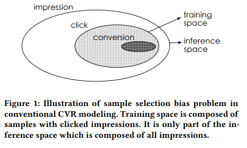
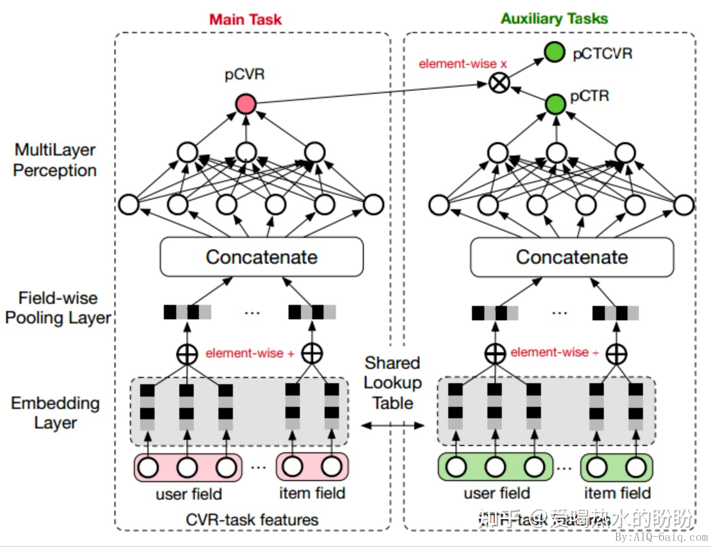
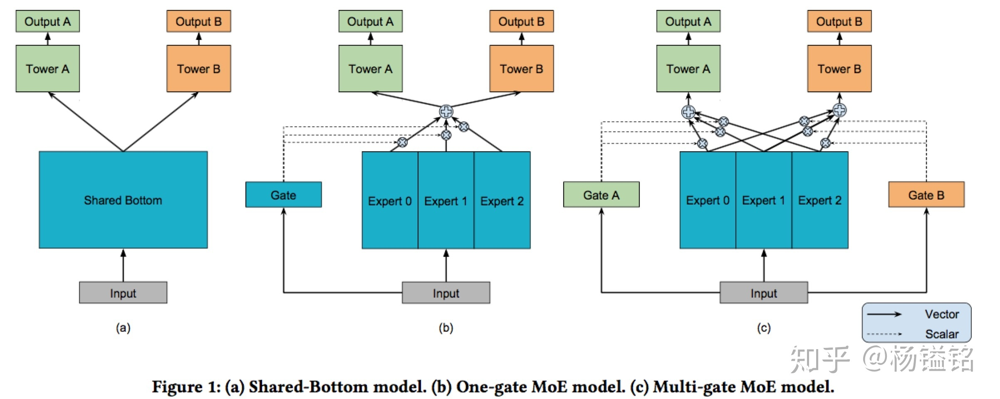

* TOC
{:toc}
# 概述
什么是多任务学习
```
给定m个任务，任务之间有所关联，目标是整合多个任务的特征来相互促进，最终使得各个任务都得到提升。
```

share-bottom结构中，各个任务底层参数完全的共享，那各个任务之间就会对参数产生不同的影响，从而加大了训练的难度。
```
优点：降低overfit风险，利用任务之间的关联性使模型学习效果更强
缺点：任务之间的相关性将严重影响模型效果。假如任务之间相关性较低，模型的效果相对会较差。
```
样本选择偏差（sample selection bias，SSB）问题
```
传统的CVR建模使用点击后的展现样本进行训练，但最终在整个展现样本空间上推理，这带来了严重的模型泛化性问题
```
数据稀疏（data sparsity，DS）问题
```
CVR模型的训练数据远远小于CTR任务，通常会差几个数量级，给模型的训练带来极大的难度。
```

# 模型
## ESSM

目的：
```
解决cvr预估时的样本选择偏差（Sample Selection Bias，SSB）和数据稀疏（Data Sparsity，DS）
```
核心思想：
```
引入CTR和CTCVR两个辅助任务。与直接在点击后的展现样本上训练CVR模型不同，ESMM把 pCVR作为一个中间变量，即 pCTCVR=pCVR*pCTR。pCTCVR和pCTR都在整个展现样本空间上进行预估，使得pCVR也在整个空间上进行预估。此时，消除了SSB问题。另外，CVR网络的特征表征参数与CTR网络共享。由于CTR网络使用更丰富的样本进行训练，这种参数迁移学习有助于明显缓解DS问题。
```
优势：
```
1.联合建模：ESMM可以同时处理CTR和CVR预测任务，将两个任务的损失函数整合到一个模型中。这样的设计可以更好地充分利用数据，同时提高两个任务的准确性。
2.解决样本选择偏差问题：在单独预测CVR时，通常会出现样本选择偏差问题，这是因为转化事件通常发生在点击事件之后。ESMM通过在整个空间上建模，可以有效地解决这一问题。
3.端到端训练： ESMM采用端到端训练方式，可以直接从原始输入数据学习CTR和CVR预测，无需额外的特征工程。
4.泛化能力强： ESMM具有较强的泛化能力，可以应用于多种推荐场景，如电商、广告、新闻推荐等。
```
缺陷：
```
1.模型复杂性： 由于需要同时处理两个任务，ESMM的模型结构相对较复杂，这可能导致较长的训练时间和较大的计算资源消耗。
2.难以解释： 作为一种基于深度学习的多任务模型，ESMM的内部结构和参数较难解释。这可能导致模型在某些情况下难以理解和调试。
3.依赖大量数据： 由于ESMM是基于深度学习的模型，它需要大量的数据来进行有效训练。在数据量较小的场景下，模型的性能可能会受到限制。
4.没有考虑cvr延迟
```

## MMOE
目的：
```
解决多任务中各个任务相关性不够导致的相互相应，引起最终的结果不稳定或者变差的问题
```
核心思想：
```
通过门控网络来实现对多个expert的控制，从而可以在共享信息和独有信息的建模中取得平衡
```
贡献：
```
1.提出了一个新颖的multi-gate mixture-of-experts模型，可以显式的建模任务之间的关系，通过gate网络自动的调节参数从在对共享的信息和特定的信息建模中取得平衡
2.合成数据验证任务的相关性对多任务学习的训练过程影响
3.在真实数据集验证有效性以及效率
```
优势：
```
1.显式建模任务之间的关系：MMoE 可以通过门控网络来建模任务之间的关系，从而在多任务学习中更好地平衡任务之间的相互影响，提高模型的泛化能力。
2.模型可训练性强：MMoE 通过共享专家子模型，可以更好地利用数据和参数，提高模型的训练效率和可训练性。
3.高度灵活性：MMoE 可以通过调整门控网络和专家子模型的数量和结构，适应不同的任务和数据分布。
```
缺陷：
```
1.计算复杂性：MMoE网络中的每个专家网络都需要单独进行训练和优化，这增加了计算复杂性。当专家网络的数量增加时，计算资源的需求也会线性增长，这可能导致训练时间较长，对计算资源要求较高。
2.模型容量：由于MMoE网络的结构需要容纳多个专家网络，因此参数量可能会迅速增长。这可能导致过拟合，特别是在数据集较小的情况下。
3.难以调试和理解：MMoE网络的结构较为复杂，可能难以理解和调试。这使得在实际应用中优化模型和解释模型预测变得更加困难。
4.权重稀疏性：MMoE网络中的多门控制器（multi-gate controller）可以使模型具有更高的表示能力，但同时也可能导致权重稀疏性问题。当权重稀疏性较高时，模型可能难以优化，导致性能下降。
5.专家网络之间的冲突：MMoE网络中的专家网络可能会学习到相互冲突的知识。在某些情况下，这可能导致模型的性能下降。
```


# 参考
1.[MTL](https://mp.weixin.qq.com/s/VtCOMbAJDOKOYz3L1q-0Ow)