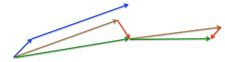

* TOC
{:toc}
# 优化方法框架

1.计算目标函数关于参数的梯度：$g_t = \nabla f(w_t)$
2.根据历史的梯度进行一阶和二阶动量：$m_{t}=\phi\left(g_{1}, g_{2}, \cdots, g_{t}\right) ; V_{t}=\psi\left(g_{1}, g_{2}, \cdots, g_{t}\right)$
3.计算当前时刻的梯度：$\begin{aligned} \eta_{t} &=\alpha \cdot m_{t} / \sqrt{V_{t}} \end{aligned}$
4.根据梯度更新参数：$w_{t+1} =w_{t}-\eta_{t}$
```
1.一阶动量：表示梯度的移动加权平均，目的在于相互抵消防止震荡。原因在于一阶使得一个向量有不同的方向。
2.二阶动量：表示梯度平方的移动加权，是在向量的模上的累加。将其置于分母可以减小学习率从而减小震荡。
```
# 优化方法
## GD
1.对于凸函数可以求得最优解，深度学习一般都是非凸问题。
2.计算过程：
	1.$g_t = \nabla f(w_t)$
	2.$\eta_{t} =\alpha$
	3.$w_{t+1} = w_{t}-\alpha g_t$
3.优缺点
```
1.优点：可以精细化参数调节、效果会较好，原理直观
2.缺点：震荡严重，对于每一个参数来说学习率都是一样的，与实际不符。在靠近极小值的时候收敛会变慢。
```

## mini-batch GD
```
1.计算的话就和上面类似，每次计算一批的梯度平均值然后更新
2.优化点在于相比较于GD的单样本更新，可以更接近的反应数据真实分布，单样本容易出现很大的偏差。
```
## Momentum
思路：
```
通过指数加权平均来替代当前梯度的更新，从而通过加权平均来抑制震荡，从而达到加速训练的目的。
```
计算过程
	1.$g_t = \nabla f(w_t)$
	2.${m_{t}=\mu * m_{t-1}+(1- \mu)g_{t}}$
	3.$\Delta \theta_{t}=-\eta * m_{t}$
优缺点：
```
1.优点：通过指数加权平均来抑制震荡，从而加速训练
2.缺点：对参数敏感，学习率固定
```
## Nesterov
思路：
```
在计算加权平均的时候，先依据加权平均得到的梯度前进一次，然后再进行加权平均，进而更新。出发点在于对梯度的更新进行修正，避免前进的太快。
```
计算过程：
	1.${g_{t}=\nabla_{\theta_{t-1}} f\left(\theta_{t-1}-\eta * \mu * m_{t-1}\right)}$ 针对上一步加权平均结果进行的前进
	2.${m_{t}=\mu * m_{t-1}+(1-\mu )g_{t}}$ 根据上一步结果进行加权平均
	3.$\Delta \theta_{t}=-\eta * m_{t}$

如上图所示：
```
1.蓝色短线为当前梯度，然后计算加权平均前进一步得到长的蓝色
2.然后在前进的方向进行指数加权平均得到棕色的长线
3.最后进行更新校正得到绿色长线 
```
优缺点：
```
1.优点：收敛快
2.缺点：计算复杂，学习率固定
```
## Adagrad
思路：
```
对学习率进行约束，从而使得每个参数对应的学习率不同。在初期梯度小的时候可以放大梯度，后期梯度大了可以约束梯度。
```
计算过程：
	1.$n_{t}=n_{t-1}+g_{t}^{2}$ 梯度平方的累加
	2.$\Delta \theta_{t}=-\frac{\eta}{\sqrt{n_{t}}+\epsilon} * g_{t}$基于梯度的累加的开方对学习率进行加权。$\epsilon$防止分母为0
优缺点：

```
1.优点：在梯度小的时候可以放大梯度，在梯度大的时候可以约束梯度。适用稀疏数据？（因为调整了不同维度的学习率，稀疏数据0较多，频率高，梯度平方和大，学习率会调整变小 ）
2.缺点：对全局学习率仍然敏感，正则项可能使得梯度退化为0，使得训练提前结束
```
## RMSprop
思路：
```
对Adagrad改进，将梯度的平方和累加转换为梯度的平方滑动平均
```
计算过程：
	1.$n_{t}=\nu * n_{t-1}+(1-\nu) * g_{t}^{2}$ 梯度平方的滑动平均
	2.$\Delta \theta_{t}=-\frac{\eta}{\sqrt{n_{t}+\epsilon}} * g_{t}$基于梯度平方的滑动平均的开方对学习率进行加权。$\epsilon$防止分母为0
优缺点：
```
1.优点：基于加权平均的形式可以消除摆动的幅度，使之减小
2.缺点：对全局学习率敏感
```
## Adadelta
思路：
```
1.解决adagrad学习率不断减小的问题
2.通过对一个窗口内的梯度进行累加来缓解adagrad的问题
```
计算过程：
$$
\Delta \theta_{t} = \frac{RMS[\Delta \theta]_{t-1}}{RMS[g]_t}g_t
$$
RMS表示指数加权平均。
优缺点：
```
1.优点：不需要设置学习率
2.缺点：训练会在最小值附近震动
```
## Adam
思路：
```
将动量加入到RMSprop中，利用一阶距估计和二阶距估计来动态对每个参数进行调整学习率
```
计算过程：
	1.$m_{t}=\mu * m_{t-1}+(1-\mu) * g_{t}$ 梯度的滑动平均
	2.$n_{t}=\nu * n_{t-1}+(1-\nu) * g_{t}^{2}$ 梯度评方的滑动平均
	3.$\hat{m}_{t}=\frac{m_{t}}{1-\mu^{t}}$ 滑动平均的修正
	4.$\hat{n}_{t}=\frac{n_{t}}{1-\nu^{t}}$ 滑动平均的修正
	5.$\Delta \theta_{t}=-\frac{\hat{m}_{t}}{\sqrt{\hat{n}_{t}}+\epsilon} * \eta$
优缺点：
```
1.优点：结合了adagrad善于处理稀疏梯度和RMSprop善于处理非平稳目标的优点、对内存需求较小、对不同的参数计算不同的自适应学习率、适用于大数据集和高维空间、参数具有确定的范围
2.缺点：二阶动量是在时间窗口内的累加，随着时间窗口的变换，遇到的数据发生巨变，使得滑动平均时大时小，不是单调变换，可能会使得模型震荡，无法收敛。
```
## Adammax
思路：
```
限制adam的学习率提供更为简单的范围
```
计算过程：
	1.$n_{t}=\max \left(\nu * n_{t-1},\left|g_{t}\right|\right)$ 约束值范围
	2.$\Delta x=-\frac{\hat{m}_{t}}{\hat n_{t}+\epsilon} * \eta$
	3.$\hat m_t = \frac{m_t}{1-u^t}$
	4.$m_{t}=\mu * m_{t-1}+(1-\mu) * g_{t}$
	5.$n_{t}=\nu * n_{t-1}+(1-\nu) * g_{t}^{2}$
优缺点：

```
1.优点：解决adam中动量比较小的时候训练缓慢的问题，替换为梯度
2.缺点：仍然可能错过全局最优解
```
## Nadam
思路：
```
带有Nesterov动量项的Adam
```
计算过程：
	1.$m_{t}=\mu * m_{t-1}+(1-\mu) * g_{t}$ 梯度的滑动平均
	2.$n_{t}=\nu * n_{t-1}+(1-\nu) * g_{t}^{2}$ 梯度评方的滑动平均
	3.$\hat{m}_{t}=\frac{m_{t}}{1-\mu^{t}}$ 滑动平均的修正
	4.$\hat{n}_{t}=\frac{n_{t}}{1-\nu^{t}}$ 滑动平均的修正
	5.$\bar{m}_{t}=\left(1-\mu_t\right) * {g}_{t}+\mu_{t+1} * \hat{m}_{t}$加入Nesterov
	6.$\Delta \theta_{t}=-\eta * \frac{\bar{m}_{t}}{\sqrt{\hat{n_{t}}}+\epsilon}$
优缺点：
```
1.优点：加速了adam
2.缺点：仍然可能错过全局最优解
```
## RAdam
思路：
```
根据方差分散度动态的打开或者关闭自适应学习率，并提出一种不需要可调参数学习预热的方法
```
计算过程：
	1.$g_{t} \leftarrow \Delta_{\theta} f_{t}\left(\theta_{t-1}\right)$第t步的梯度计算
	2.$m_{t}=\mu * m_{t-1}+(1-\mu) * g_{t}$ 梯度的滑动平均
	3.$n_{t}=\nu * n_{t-1}+(1-\nu) * g_{t}^{2}$ 梯度评方的滑动平均
	4.$\hat{m}_{t}=\frac{m_{t}}{1-\mu^{t}}$ 滑动平均的修正
	5.$\rho_{t} \leftarrow \rho_{\infty}-2 t \beta_{2}^{t} /\left(1-\beta_{2}^{t}\right)$计算简单移动平均值的最大值
	6.如果$rho_{\infty} > 4$ 移动量二阶矩的修正值和方差修正范围
		1.$\widehat{n_{t}} \leftarrow \sqrt{n_{t} /\left(1-\beta_{2}^{t}\right)}$ 
		2.$r_{t} \leftarrow \sqrt{\frac{\left(\rho_{t}-4\right)\left(\rho_{t}-2\right) \rho_{\infty}}{\left(\rho_{\infty}-4\right)\left(\rho_{\infty}-2\right) \rho_{t}}}$
		3.$\theta_{t} \leftarrow \theta_{t-1}-\alpha_{t} r_{t} \widehat{m_{t}} / \widehat{v_{t}}$
	 7.如果$rho_{\infty} < 4$ 则使用非自适应动量更新参数
	 	$\theta_{t} \leftarrow \theta_{t-1}-\alpha_{t} \widehat{m_{t}}$
优缺点：
```
带来更好的性能，但是精调还是不能完全超越SGD
```
## lookhead
思路：
```
通过一些策略来优化当前的优化算法，不改变算法本身
```
计算过程：
	1.通过k次的循环来基于基础的优化器来进行权重的更新计算（faset weights）
	2.选择最后一次的更新来作为后面计算的基本
	3.基于移动滑动平均来对上述的计算结果进行再计算（slow weights）

优缺点：
```
可以有效的降低方差，对参数敏感度降低，可以实现更快的收敛速度。
```
## ranger：lookhead+Radam
思路i：
```
将lookhead中的基础优化器换为Radam
```

## Sophia
Adaw
# 参考

1.[吴恩达](https://github.com/fengdu78/deeplearning_ai_books/blob/master/markdown/lesson2-week2.md)
2.[知乎](https://zhuanlan.zhihu.com/p/22252270)
3.[AdaDelta](https://www.cnblogs.com/neopenx/p/4768388.html)
4.[Adam](https://wulc.me/2019/03/18/Adam%E9%82%A3%E4%B9%88%E6%A3%92%EF%BC%8C%E4%B8%BA%E4%BB%80%E4%B9%88%E8%BF%98%E5%AF%B9SGD%E5%BF%B5%E5%BF%B5%E4%B8%8D%E5%BF%98/)
5.[优化算法](https://www.cnblogs.com/shixiangwan/p/7532830.html)