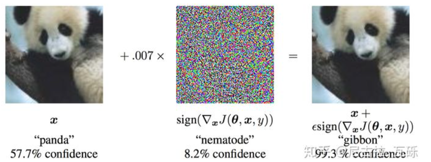

* TOC
{:toc}

# 基本概念
对抗训练是一种增量神经网络鲁棒性的方式，在实现的过程中，通过针对样本的扰动来使得网络进行适应变化，从而对对抗样本具有鲁棒性。

对抗样本一般特征：
```
1.相对于原始的输入，所添加的扰动时微小的
2.可以使得模型犯错
```


[对抗训练概念](https://arxiv.org/abs/1412.6572)：在原始的输入x中加入扰动$r_{adv}$，得到对抗样本参加训练。
$$
\min _{\theta}-\log P\left(y \mid x+r_{a d v} ; \theta\right)
$$
其中，y表示标签，$\theta$为模型的参数，在论文中给出的解释是，神经网络由于其线性的特点，很容易受到线性扰动的干扰，所以提出Fast Gradient Sign Method (FGSM)来进行扰动的计算，扰动定义为：
$$
r_{a d v}=\epsilon \cdot \operatorname{sgn}\left(\nabla_{x} L(\theta, x, y)\right)
$$
其中sign为符号函数，L为损失函数，在论文中指出$\epsilon=0.25$的时候扰动比较成功。
```
对上面扰动的理解：将输入的样本朝着损失上升的方向再进一步，得到的对抗样本就可以造成更大的损失，提高模型的错误率。
```
# 攻击模式
白盒攻击：
```
获取到所使用算法的名称以及相关参数，在具体攻击时可以与系统进行交互
```
黑盒攻击：
```
不了解具体的模型，但仍可同系统进行交互，可以传递输入观测输出
```
无目标攻击：
```
对一个样本进行对抗样本的生成，促使系统对其分类错误，但是不关注其具体的类别
```
有目标攻击：
```
对一个样本进行对抗样本的生成，同时还可以指定其所属的类别
```
# 对抗学习

在[Towards Deep Learning Models Resistant to Adversarial Attacks](https://arxiv.org/abs/1706.06083)中总结了对抗学习的一般形式：
$$
\min _{\theta} \mathbb{E}_{(x, y) \sim \mathcal{D}}\left[\max _{r_{a d v} \in \mathcal{S}} L\left(\theta, x+r_{a d v}, y\right)\right]
$$
公式分为两部分，第一部分表示内部的损失函数最大，第二十外部的经验风险最小。同时，内部的max是为了找到最好的扰动形式，L为损失函数，S为扰动的范维空间。外部的min表示在当前所找到的扰动下找到最鲁棒的模型参数，其中D表示输入样本的分布。

传统的对抗学习都是在CV领域的，因为其输入天然的具有连续性，反思NLP问题，由于其输入时离散的单词序列，导致其无法直接在输入上进行扰动。论文[Adversarial Training Methods for Semi-Supervised Text Classification](https://arxiv.org/abs/1605.07725)中指出可以在连续的embedding中进行扰动。

## FGM
```
对于每个x:
  1.计算x的前向loss、反向传播得到梯度
  2.根据embedding矩阵的梯度计算出r，并加到当前embedding上，相当于x+r
  3.计算x+r的前向loss，反向传播得到对抗的梯度，累加到(1)的梯度上
  4.将embedding恢复为(1)时的值
  5.根据(3)的梯度对参数进行更新
```
论文[Adversarial Training Methods for Semi-Supervised Text Classification](https://arxiv.org/abs/1605.07725)提出Fast Gradient Method（FGM）其假设输入的文本序列为$embedding vectors[v_1,v_2,...,v_T]$为x，embedding的扰动为：
$$
\begin{aligned}
r_{a d v} &=\epsilon \cdot g /\|g\|_{2} \\
g &=\nabla_{x} L(\theta, x, y)
\end{aligned}
$$
与原始提出的FGSM做了一点改变，取消了符号函数，基于二范式做了一个scale。
```python
import torch
class FGM():
    def __init__(self, model):
        self.model = model
        self.backup = {}

    def attack(self, epsilon=1., emb_name='emb.'):
        # emb_name这个参数要换成你模型中embedding的参数名
        for name, param in self.model.named_parameters():
            if param.requires_grad and emb_name in name:
                self.backup[name] = param.data.clone()
                norm = torch.norm(param.grad)
                if norm != 0 and not torch.isnan(norm):
                    r_at = epsilon * param.grad / norm
                    param.data.add_(r_at)

    def restore(self, emb_name='emb.'):
        # emb_name这个参数要换成你模型中embedding的参数名
        for name, param in self.model.named_parameters():
            if param.requires_grad and emb_name in name: 
                assert name in self.backup
                param.data = self.backup[name]
        self.backup = {}
# 使用
# 初始化
fgm = FGM(model)
for batch_input, batch_label in data:
    # 正常训练
    loss = model(batch_input, batch_label)
    loss.backward() # 反向传播，得到正常的grad
    # 对抗训练
    fgm.attack() # 在embedding上添加对抗扰动
    loss_adv = model(batch_input, batch_label)
    loss_adv.backward() # 反向传播，并在正常的grad基础上，累加对抗训练的梯度
    fgm.restore() # 恢复embedding参数
    # 梯度下降，更新参数
    optimizer.step()
    model.zero_grad()
```
## PGD
```
对于每个x:
  1.计算x的前向loss、反向传播得到梯度并备份
  对于每步t:
    2.根据embedding矩阵的梯度计算出r，并加到当前embedding上，相当于x+r(超出范围则投影回epsilon内)
    3.t不是最后一步: 将梯度归0，根据1的x+r计算前后向并得到梯度
    4.t是最后一步: 恢复(1)的梯度，计算最后的x+r并将梯度累加到(1)上
  5.将embedding恢复为(1)时的值
  6.根据(4)的梯度对参数进行更新
```
论文[Towards Deep Learning Models Resistant to Adversarial Attacks](https://arxiv.org/abs/1706.06083)中提出Projected Gradient Descent（PGD）。相较于FGM的一步到位，PGD的实现方式是多步走，如果走出扰动半径就拉回。
$$
\begin{aligned}
x_{t+1} &=\Pi_{x+\mathcal{S}}\left(x_{t}+\alpha g\left(x_{t}\right) /\left\|g\left(x_{t}\right)\right\|_{2}\right) \\
g\left(x_{t}\right) &=\nabla_{x} L\left(\theta, x_{t}, y\right)
\end{aligned}
$$
其中$\mathcal{S}=r \in \mathbb{R}^{d}:\|r\|_{2} \leq \epsilon$为扰动的约束空间，$\alpha$为小步的步长。
```python
import torch
class PGD():
    def __init__(self, model):
        self.model = model
        self.emb_backup = {}
        self.grad_backup = {}

    def attack(self, epsilon=1., alpha=0.3, emb_name='emb.', is_first_attack=False):
        # emb_name这个参数要换成你模型中embedding的参数名
        for name, param in self.model.named_parameters():
            if param.requires_grad and emb_name in name:
                if is_first_attack:
                    self.emb_backup[name] = param.data.clone()
                norm = torch.norm(param.grad)
                if norm != 0 and not torch.isnan(norm):
                    r_at = alpha * param.grad / norm
                    param.data.add_(r_at)
                    param.data = self.project(name, param.data, epsilon)

    def restore(self, emb_name='emb.'):
        # emb_name这个参数要换成你模型中embedding的参数名
        for name, param in self.model.named_parameters():
            if param.requires_grad and emb_name in name: 
                assert name in self.emb_backup
                param.data = self.emb_backup[name]
        self.emb_backup = {}

    def project(self, param_name, param_data, epsilon):
        r = param_data - self.emb_backup[param_name]
        if torch.norm(r) > epsilon:
            r = epsilon * r / torch.norm(r)
        return self.emb_backup[param_name] + r

    def backup_grad(self):
        for name, param in self.model.named_parameters():
            if param.requires_grad:
                self.grad_backup[name] = param.grad.clone()

    def restore_grad(self):
        for name, param in self.model.named_parameters():
            if param.requires_grad:
                param.grad = self.grad_backup[name]
# 使用
pgd = PGD(model)
K = 3
for batch_input, batch_label in data:
    # 正常训练
    loss = model(batch_input, batch_label)
    loss.backward() # 反向传播，得到正常的grad
    pgd.backup_grad()
    # 对抗训练
    for t in range(K):
        pgd.attack(is_first_attack=(t==0)) # 在embedding上添加对抗扰动, first attack时备份param.data
        if t != K-1:
            model.zero_grad()
        else:
            pgd.restore_grad()
        loss_adv = model(batch_input, batch_label)
        loss_adv.backward() # 反向传播，并在正常的grad基础上，累加对抗训练的梯度
    pgd.restore() # 恢复embedding参数
    # 梯度下降，更新参数
    optimizer.step()
    model.zero_grad()
```
## FreeAT 
```
初始化r=0
对于epoch=1...N/m:
  对于每个x:
    对于每步m:
      1.利用上一步的r，计算x+r的前后向，得到梯度
      2.根据梯度更新参数
      3.根据梯度更新r
```
论文[Adversarial Training for Free!](https://arxiv.org/abs/1904.12843)提出FreeAT (Free Adversarial Training)。核心点在于优化PGD扰动的计算效率。
缺点：
```
FreeLB指出，FreeAT的问题在于每次的r对于当前的参数都是次优的（无法最大化loss），因为当前r是由r(t-1)和theta(t-1)计算出来的，是对于theta(t-1)的最优。
```
[代码](https://github.com/mahyarnajibi/FreeAdversarialTraining/blob/d70774030871fa3207e09ce8528c1b84cd690603/main_free.py#L160)


# 参考
1.[NLP中的对抗训练 + PyTorch实现](https://zhuanlan.zhihu.com/p/91269728)
2.[一文搞懂对抗训练](https://zhuanlan.zhihu.com/p/103593948)
3.[nlp中的对抗训练学习](https://coding-zuo.github.io/2021/04/07/nlp%E4%B8%AD%E7%9A%84%E5%AF%B9%E6%8A%97%E8%AE%AD%E7%BB%83-%E4%B8%8Ebert%E7%BB%93%E5%90%88/)


