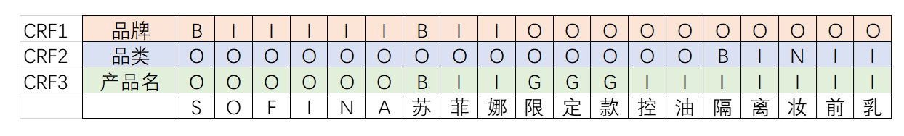
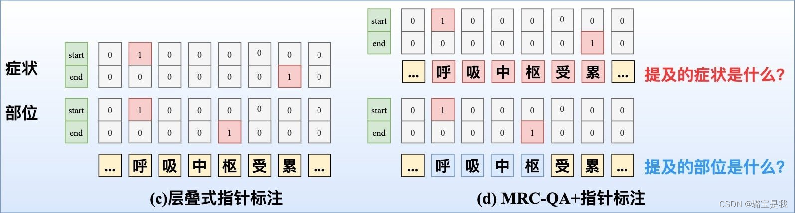
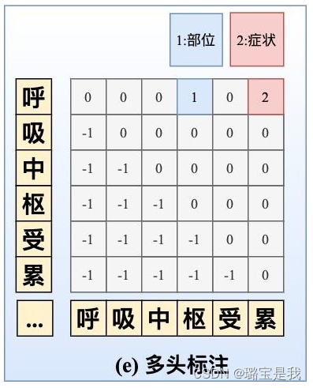

* TOC
{:toc}

# 基础概念
## bert+crf的不足
复杂场景：flat、nested ner以及不连续ner等复杂场景的出现
线上推断效率：crf的解码速度与文本长度呈现线性关系
更好的效果：crf虽然引入了无向图但是并没有从全局出发来考虑问题，只是考约束了相连接点之间的关联。


识别品牌、品类、产品名

## 嵌套Nested
组间嵌套：隔离妆前乳即属于品类也属于产品的一部分
组内嵌套：妆前乳即是单独的品类也属于品类妆前乳的一部分
通过共享bert 以及多层的crf可以解决
## 不连续
苏菲娜控油隔离妆前乳为不连续的产品名
增加标签可以解决，比如图中的G标签标识不提取
## 序列标注范式
IOB1：标签I用于文本块中的字符，O用于文本块之外的字符，B表示一个文本块的开始，且该文本块紧挨着上一个组块
IOB2：B表示当前文本块的开始，IO的含义与1相同
IOE1：E表示文本块的结尾，且该组块连接着下一个组块，IO与IOB1相同
IOE2：E表示文本块结尾，IO与IOB1相同
IOBES：B表示两个以上字组成文本块的开始，E表示两个以上文本块的结尾，I表示三个以上文本块的中间，S表示单个字的块，O表示文本块之外

## MRC范式
针对label给出描述性话术，从而以阅读理解的形式来完成实体抽取：
{
  "DRUG": "找出药物：用于预防、治疗、诊断疾病并具有康复与保健作用的物质。",
  "DRUG_INGREDIENT": "找出药物成分：中药组成成分，指中药复方中所含有的所有与该复方临床应用目的密切相关的药理活性成分。",
  "DISEASE": "找出疾病：指人体在一定原因的损害性作用下，因自稳调节紊乱而发生的异常生命活动过程，会影响生物体的部分或是所有器官。",
  "SYMPTOM": "找出症状：指疾病过程中机体内的一系列机能、代谢和形态结构异常变化所引起的病人主观上的异常感觉或某些客观病态改变。",
  "SYNDROME": "找出症候：概括为一系列有相互关联的症状总称，是指不同症状和体征的综合表现。",
  "DISEASE_GROUP": "找出疾病分组：疾病涉及有人体组织部位的疾病名称的统称概念，非某项具体医学疾病。",
  "FOOD": "找出食物：指能够满足机体正常生理和生化能量需求，并能延续正常寿命的物质。",
  "FOOD_GROUP": "找出食物分组：中医中饮食养生中，将食物分为寒热温凉四性，同时中医药禁忌中对于具有某类共同属性食物的统称，记为食物分组。",
  "PERSON_GROUP": "找出人群：中医药的适用及禁忌范围内相关特定人群。",
  "DRUG_GROUP": "找出药品分组：具有某一类共同属性的药品类统称概念，非某项具体药品名。例子：止咳药、退烧药",
  "DRUG_DOSAGE": "找出药物剂量：药物在供给临床使用前，均必须制成适合于医疗和预防应用的形式，成为药物剂型。",
  "DRUG_TASTE": "找出药物性味：药品的性质和气味。例子：味甘、酸涩、气凉。",
  "DRUG_EFFICACY": "找出中药功效：药品的主治功能和效果的统称。例子：滋阴补肾、去瘀生新、活血化瘀"
}
## 指针范式

## 多头标注

# 典型模型
[bilstm+crf](https://zwt0204.github.io/2020/05/18/BILSTM+CRF/)
[bert+crf](https://github.com/lonePatient/BERT-NER-Pytorch)
[bert+mrc](https://github.com/z814081807/DeepNER)
[mrc-for-flat-nested-ner](https://github.com/ShannonAI/mrc-for-flat-nested-ner)
[GlobalPointe-keras](https://github.com/bojone/GlobalPointer)
[GlobalPointe-torch](https://github.com/gaohongkui/GlobalPointer_pytorch)
[multi_head](https://github.com/suolyer/PyTorch_BERT_MultiHead_NER)
[lear](https://github.com/ Akeepers/LEAR)

# 总结
```python
1.bert+crf比较好的baseline，主要主义的点crf层的学习率最好是bert的100倍+
2.任务比较垂直，且有大量的漏标数据，可以尝试多头标注+负采样
3.有相似的数据集可以做预训练，bert+mrc
```

# 参考
1. [工业界如何解决NER问题？12个trick](https://zhuanlan.zhihu.com/p/152463745)
2. [中文NER的正确打开方式: 词汇增强方法总结](https://zhuanlan.zhihu.com/p/142615620)
3. [标注数据存在错误怎么办](https://zhuanlan.zhihu.com/p/146557232)
4. [标注样本少怎么办](https://zhuanlan.zhihu.com/p/146777068)
5. [crf新范式](https://zhuanlan.zhihu.com/p/469879435)
6. [crf层学习率调整](https://kexue.fm/archives/7196)
7. [crf](https://kexue.fm/archives/5542)
8. [lear](https://mp.weixin.qq.com/s/ydqd7nfktzgm4PamA3mnVQ)
9. [bert+mrc](https://mp.weixin.qq.com/s?__biz=Mzg4OTY3ODQ1NQ==&mid=2247486534&idx=1&sn=876708e8ea2cde593a7c07a52be521ef&chksm=cfe9735ef89efa481f3946a59dbc55fab8a54ad7ffe5ac9a89e69c4d0148b2d07de2f7ff3a0b&token=1914820838&lang=zh_CN&scene=21#wechat_redirect)