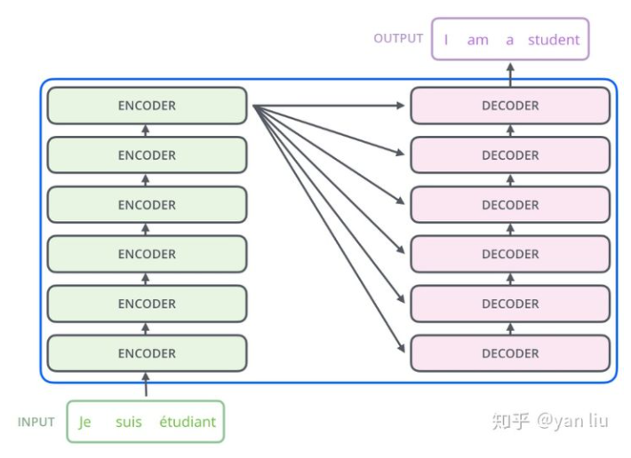
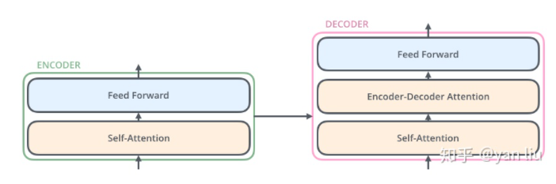
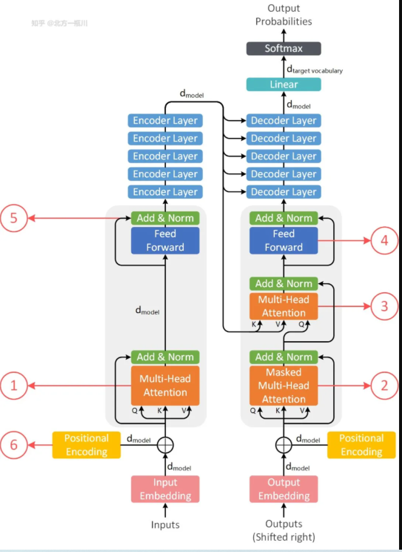
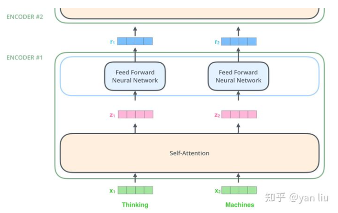
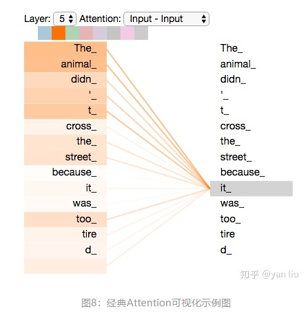
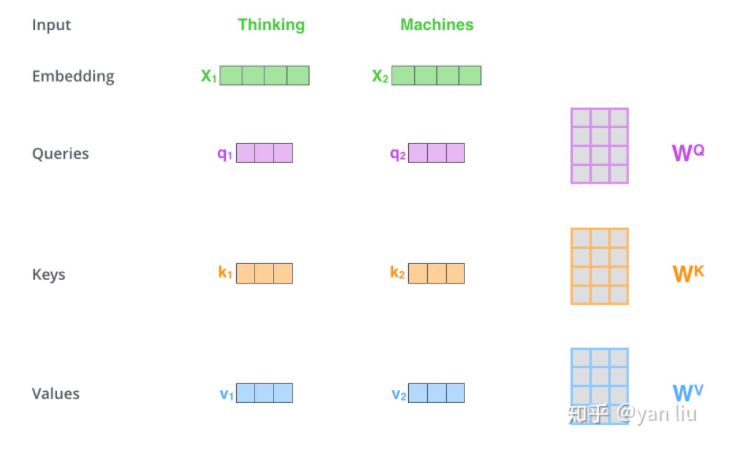
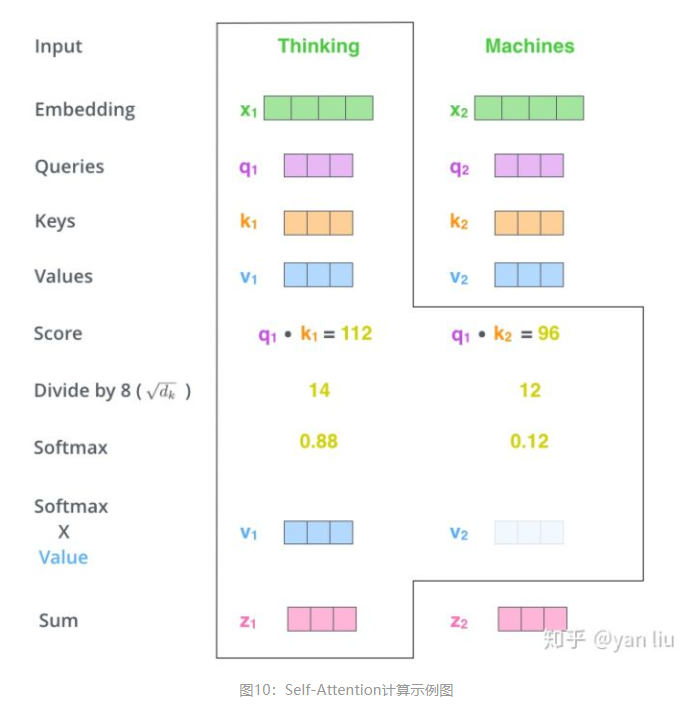
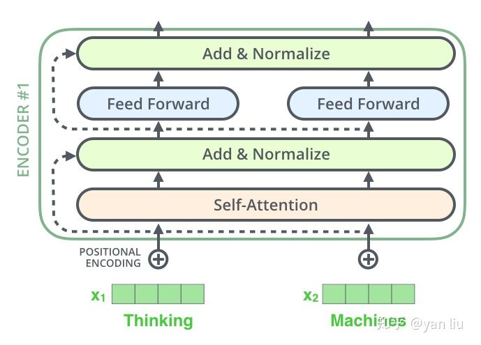
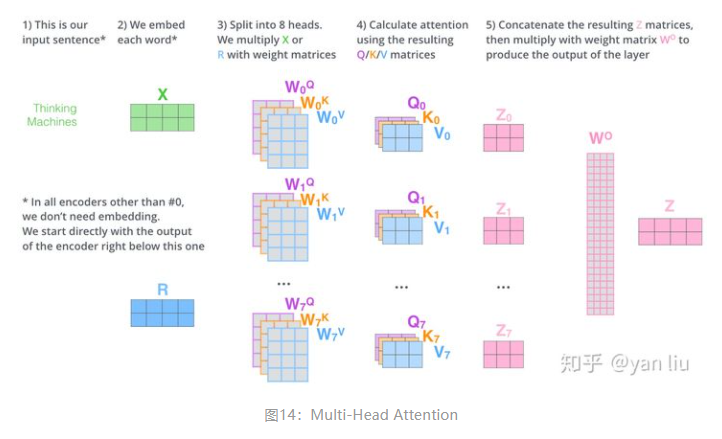
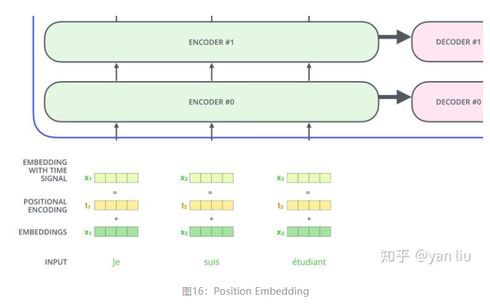

* TOC
{:toc}
# 来源

核心的原因在于考虑到rnn在计算中限制的顺序性，在具体的计算过程中没有办法并行化：
```
1.t时刻依赖t-1时刻的结果，限制并行
2.顺序计算过程中导致的信息丢失
```
论文中的定义：
```
Transformer is the first transduction model relying entirely on self-attention to compute representations of its input and output without using sequence aligned RNNs or convolution
```
# Transformer整体结构


如上如所示：整体的transformer的结构是基于6层的编码层和6层的解码层组成，和seq2seq模型结构类似，只是在具体的编码解码模块做了替换。
Encoder结构：

其中seif-attention的计算：
$$
\operatorname{Attention}(Q, K, V)=\operatorname{softmax}\left(\frac{Q K^{T}}{\sqrt{d_{k}}}\right) V
$$
Feed Forward Neural Network的计算：
$$
\operatorname{FFN}(Z)=\max \left(0, Z W_{1}+b_{1}\right) W_{2}+b_{2}
$$
Decoder结构：

Decoder 由 6 个完全相同的 Decoder Layer 组成，每个 Decoder Layer 由三个 Sub-Layer 组成：
```
1.Maked Multi-Head Attention，相比于 Encoder 的 Attention，它加入了掩码，遮住当前单词后面的内容；
2.Multi-Head Attention，用 Encoder 的输出作为 Key 和 Value，Query 由 Decoder 提供；
3.Feed Forward，与 Encoder 的一致，都是全连接层。Decoder 也采用了残差连接和 Layer Normalization，与 Encoder 一致。
```

# 输入编码
首先基于外部预训练的词向量来初始化特征向量或者是随机初始化。在论文中所给出的维度是512。在encoder的输入端，特征向量作为整体的输入。对于其他层的输入则是下层网络的输出。如图所示：


# self-Attention

在self-attention中，每一个单词会被表示为三个不同的向量，分别微Query，Key，Value，长度均为64。生成的方式是基于三个不同的权值矩阵与输入相乘得到，三个矩阵都是512*64维。

整体的计算过程如下：
第一步：将输入转为向量模式
第二步：根据输入得到q，k，v三个向量
第三步：计算每个向量的score，score=q.k
第四步：为了梯度计算的稳定，将score归一化，除以$\sqrt d_k$
第五步：对score施加以softmax
第六步：第五步计算结果与v点乘，得到加权的每个输入向量的评分v
第七步：相加之后得到最终的输出结果$z=\sum v$

注意的是在self中加入了残差网络来解决深度学习中的退化问题，同时为了模型更快速稳定加入了Layer Normalization。$LayerNorm(x+SubLayer(x))$

# multi-head Atterntion
Multi-Head Attention相当于 [公式] 个不同的self-attention的集成（ensemble）具体可以分为三个步骤：
第一步：将输入分别输入到8个相同的selfattention结构中，得到8个加权的特征矩阵
第二步：将8个特征向量拼接
第三步：拼接后的特征向量经过一层全连接转换为z

# Encoder-Decoder Attention
这个是在解码器中多出来的一部分，在其内部，q来自于解码器的上一个输出，k，v泽来自于编码器的输出。
注意在进行机器翻译的工作时：
```
解码过程是一个顺序操作的过程，也就是当解码第 k个特征向量时，我们只能看到第 k-1 及其之前的解码结果，论文中把这种情况下的multi-head attention叫做masked multi-head attention。
```
# 损失层
解码器解码之后，解码的特征向量经过一层激活函数为softmax的全连接层之后得到反映每个单词概率的输出向量。此时我们便可以通过CTC等损失函数训练模型了。

# 位置编码
当前已经介绍的内容并没有涉及到模型对序列化顺序的处理能力，也就是说句子顺序打乱并不会影响模型的结果，从这个角度分析，其只能说是一个更为强大的词袋模型。
为了解决顺序性问题，transformer中引入了位置编码。位置编码的引入有两种，一种是根据数据取学习，一种是自己设计编码规则。在transformer中是基于第二种所设计的。

在论文中给出的公式为：
$$
\begin{gathered}
P E(\text { pos }, 2 i)=\sin \left(\frac{\text { pos }}{10000 \frac{2 i}{d_{\text {model }}}}\right) \\
P E(\text { pos }, 2 i+1)=\cos \left(\frac{\text { pos }}{10000 \frac{2 i}{d_{\text {model }}}}\right)
\end{gathered}
$$
其中pos表示单词的位置，i表示单词的维度。
设计此公式的目的是考虑单词之间的相对位置。根据公式$\sin (\alpha+\beta)=\sin \alpha \cos \beta+\cos \alpha \sin \beta, \cos (\alpha+\beta)=\cos \alpha \cos \beta-\sin \alpha \sin \beta$可以看出来，位置k+p的位置向量可以通过位置k的特征向量线性变化而来，这就可以辅助模型来捕获单词之间的相对位置。

# 总结
优点：
（1）虽然Transformer最终也没有逃脱传统学习的套路，Transformer也只是一个全连接（或者是一维卷积）加Attention的结合体。但是其设计已经足够有创新，因为其抛弃了在NLP中最根本的RNN或者CNN并且取得了非常不错的效果，算法的设计非常精彩，值得每个深度学习的相关人员仔细研究和品位。
（2）Transformer的设计最大的带来性能提升的关键是将任意两个单词的距离是1，这对解决NLP中棘手的长期依赖问题是非常有效的。
（3）Transformer不仅仅可以应用在NLP的机器翻译领域，甚至可以不局限于NLP领域，是非常有科研潜力的一个方向。
（4）算法的并行性非常好，符合目前的硬件（主要指GPU）环境。

缺点：
（1）粗暴的抛弃RNN和CNN虽然非常炫技，但是它也使模型丧失了捕捉局部特征的能力，RNN + CNN + Transformer的结合可能会带来更好的效果。
（2）Transformer失去的位置信息其实在NLP中非常重要，而论文中在特征向量中加入Position Embedding也只是一个权宜之计，并没有改变Transformer结构上的固有缺陷。

# 参考
1.[详解Transformer](https://zhuanlan.zhihu.com/p/48508221)
2.[回顾transformer](https://mp.weixin.qq.com/s/wC5-9Elc0LtHH484W5oNDQ)